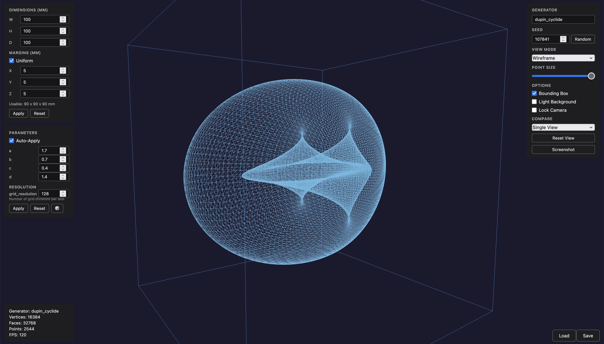
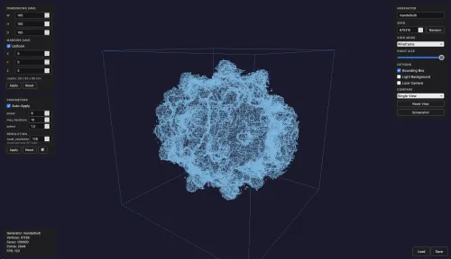
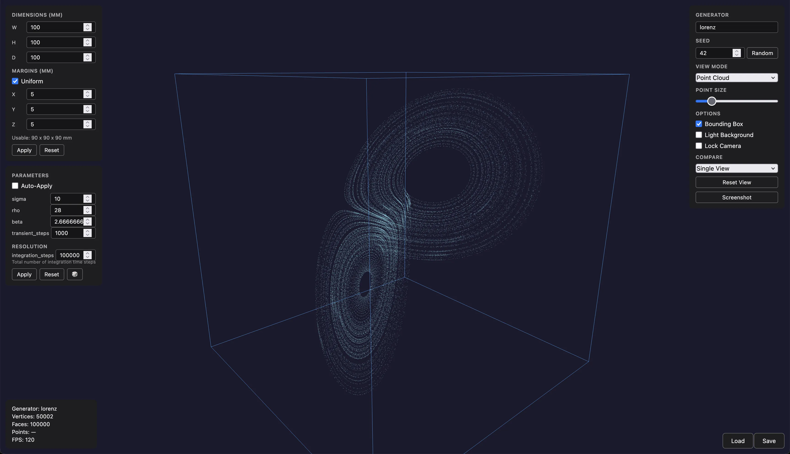
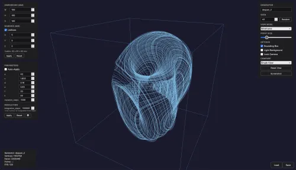
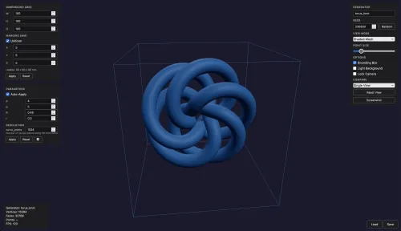
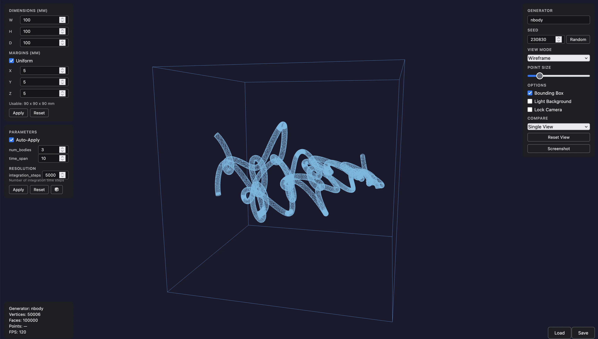
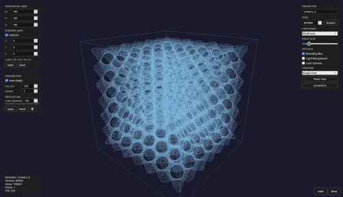
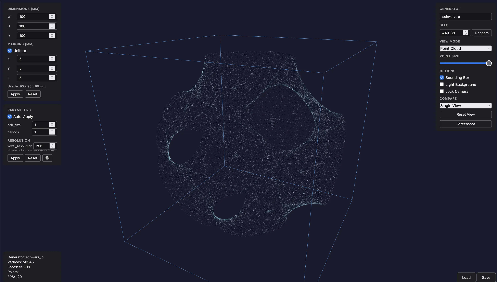
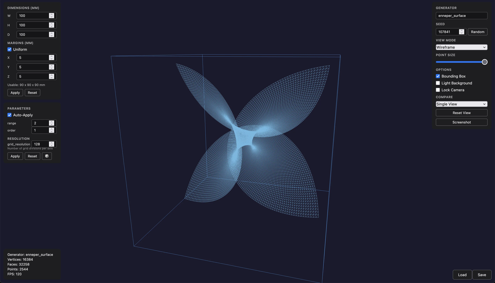

# MathViz

MathViz is a pipeline for programmatically generating 3D mathematical forms —
strange attractors, fractals, knots, minimal surfaces, and more — and preparing
them for subsurface laser engraving in crystal glass blocks. The output is a
wall-mounted installation of glass blocks arranged in a grid, each containing a
unique form rendered as a monochrome point cloud of micro-fractures.

<table>
  <tr>
    <td><a href="screenshots/1.png"></a></td>
    <td><a href="screenshots/2.png"></a></td>
    <td><a href="screenshots/3.png"></a></td>
  </tr>
  <tr>
    <td><a href="screenshots/4.png"></a></td>
    <td><a href="screenshots/5.png"></a></td>
    <td><a href="screenshots/6.png"></a></td>
  </tr>
  <tr>
    <td><a href="screenshots/7.png"></a></td>
    <td><a href="screenshots/8.png"></a></td>
    <td><a href="screenshots/9.png"></a></td>
  </tr>
</table>

## Features

- **79 generators** across 12 categories (attractors, fractals, knots, parametric surfaces, and more)
- **Linear pipeline**: Generate → Represent → Transform → Sample → Validate → Export
- **9 representation strategies** for controlling how forms appear when engraved
- **Deterministic output**: every form is reproducible from its seed
- **Grid manifest** for managing multi-block installations
- **Interactive 3D preview** via browser (Three.js + FastAPI)
- **High-resolution rendering** to PNG (3D and 2D projections)
- **Configurable containers**: glass block dimensions, margins, and placement policies
- **Sampling profiles**: preview (fast) and production (high-quality)
- **Format conversion**: STL, OBJ, PLY, GLB, XYZ, PCD

## Installation

Requires Python 3.11+.

```bash
pip install .
```

### Optional extras

```bash
# High-resolution 3D/2D rendering (requires PyVista)
pip install ".[render]"

# Development tools (pytest, ruff, httpx)
pip install ".[dev]"
```

## Quickstart

Generate a Lorenz attractor and export to PLY:

```bash
mathviz generate lorenz --output lorenz.ply
```

Preview interactively in the browser:

```bash
mathviz preview lorenz
```

List all available generators:

```bash
mathviz list
```

Get detailed info about a generator:

```bash
mathviz info lorenz
```

Override parameters and seed:

```bash
mathviz generate lorenz --param sigma=12 --param rho=30 --seed 7 --output lorenz.ply
```

Use a sampling profile for production quality:

```bash
mathviz generate gyroid --profile production --output gyroid.ply
```

## Generators

| Category | Count | Generators | Description |
|---|---|---|---|
| attractors | 10 | `lorenz`, `rossler`, `chen`, `aizawa`, `thomas`, `halvorsen`, `double_pendulum`, `clifford`, `dequan_li`, `sprott` | Strange attractor trajectories |
| curves | 4 | `cardioid`, `fibonacci_spiral`, `lissajous_curve`, `logarithmic_spiral` | Mathematical curves extended to 3D |
| data_driven | 3 | `building_extrude`, `heightmap`, `soundwave` | Forms derived from external data files |
| fractals | 7 | `apollonian_3d`, `burning_ship`, `fractal_slice`, `julia3d`, `mandelbrot_heightmap`, `mandelbulb`, `menger_sponge` | 3D fractals and fractal heightmaps |
| geometry | 3 | `generic_parametric`, `voronoi_3d`, `voronoi_sphere` | User-defined parametric surfaces and Voronoi |
| implicit | 4 | `gyroid`, `schwarz_d`, `schwarz_p`, `genus2_surface` | Triply periodic minimal surfaces via marching cubes |
| knots | 9 | `torus_knot`, `figure_eight_knot`, `lissajous_knot`, `seven_crossing_knots`, `trefoil_on_torus`, `pretzel_knot`, `cinquefoil_knot`, `borromean_rings`, `chain_links` | Mathematical knot curves and linked structures |
| number_theory | 4 | `digit_encoding`, `prime_gaps`, `sacks_spiral`, `ulam_spiral` | Number-theoretic visualizations |
| parametric | 17 | `bour_surface`, `boy_surface`, `calabi_yau`, `costa_surface`, `cross_cap`, `dini_surface`, `dna_helix`, `dupin_cyclide`, `enneper_surface`, `klein_bottle`, `lissajous_surface`, `mobius_strip`, `roman_surface`, `seifert_surface`, `spherical_harmonics`, `superellipsoid`, `torus` | Parametric surface meshes |
| physics | 6 | `kepler_orbit`, `nbody`, `planetary_positions`, `electron_orbital`, `gravitational_lensing`, `wave_interference` | Physics simulations |
| procedural | 5 | `noise_surface`, `reaction_diffusion`, `terrain`, `lsystem`, `rd_surface` | Procedurally generated surfaces and structures |
| surfaces | 1 | `parabolic_envelope` | Ruled surfaces and envelopes |

See [docs/generators.md](docs/generators.md) for full parameter tables and examples.

## CLI Commands

| Command | Description |
|---|---|
| `mathviz generate` | Run a generator through the full pipeline |
| `mathviz list` | List all available generators |
| `mathviz info` | Show generator details and parameter schema |
| `mathviz validate` | Generate and validate without exporting |
| `mathviz preview` | Start interactive 3D preview server |
| `mathviz render` | High-resolution 3D PNG rendering |
| `mathviz render-2d` | 2D projection rendering |
| `mathviz render-all` | Batch render all generators in parallel |
| `mathviz benchmark` | Pipeline performance benchmarking |
| `mathviz convert` | Convert geometry between formats |
| `mathviz sample` | Sample a mesh into a point cloud |
| `mathviz transform` | Fit geometry within a container |
| `mathviz schema` | Generate JSON Schema files from config models |
| `mathviz grid init` | Create a new grid manifest |
| `mathviz grid show` | Display the grid |
| `mathviz grid assign` | Assign a preset to a grid position |
| `mathviz grid status` | Show or update block status |
| `mathviz grid neighbors` | Show surrounding blocks |
| `mathviz grid summary` | Show counts by status |
| `mathviz grid export-all` | Batch export all assigned blocks |

See [docs/cli.md](docs/cli.md) for full flag reference and examples.

## Documentation

- [Generators](docs/generators.md) — all generator categories with parameter tables and examples
- [Pipeline](docs/pipeline.md) — the Generate → Represent → Transform → Sample → Validate → Export pipeline
- [CLI Reference](docs/cli.md) — every CLI command with flags, options, and examples
- [Configuration](docs/configuration.md) — config file format, precedence rules, sampling profiles
- [Representation Strategies](docs/representation.md) — how raw geometry is realized for engraving
- [Preview UI](docs/preview.md) — interactive 3D preview with comparison mode, snapshots, and keyboard shortcuts
- [Rendering](docs/rendering.md) — `render`, `render-2d`, and `render-all` commands, optional dependencies
- [Grid Layout](docs/grid.md) — grid manifest format and grid CLI
- [Python API](docs/api.md) — using MathViz as a Python library

## Testing

```bash
pip install ".[dev]"
pytest
```

## License

See LICENSE file for details.
