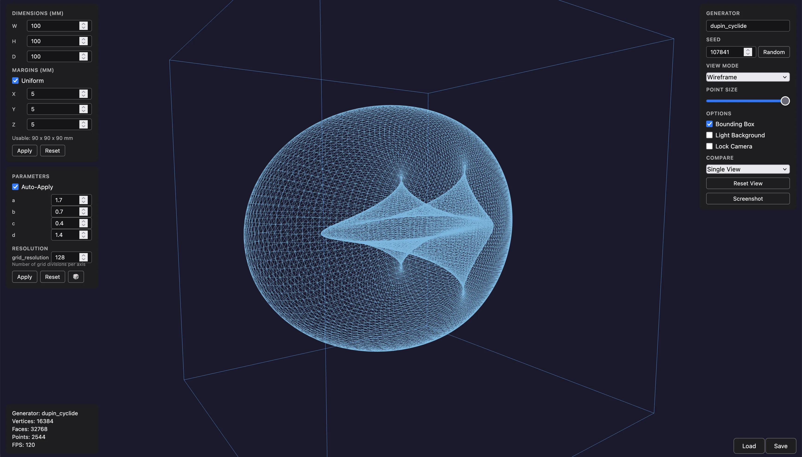
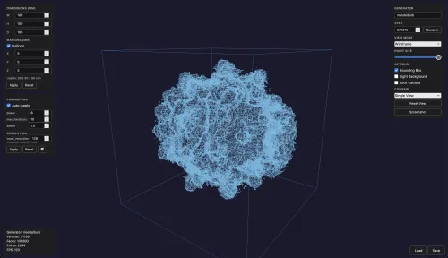
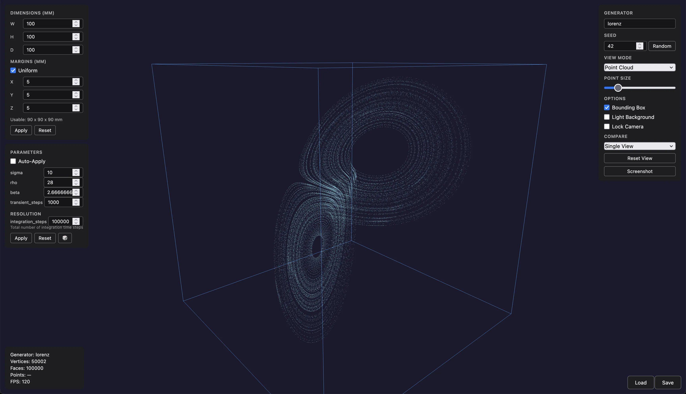
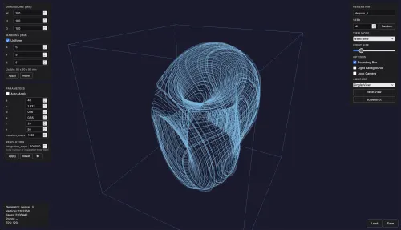
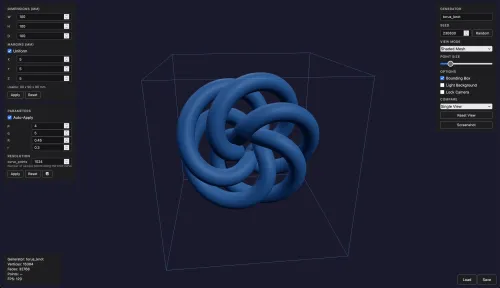
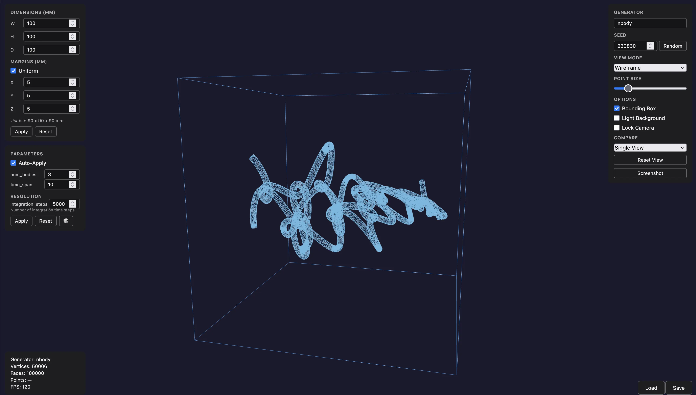
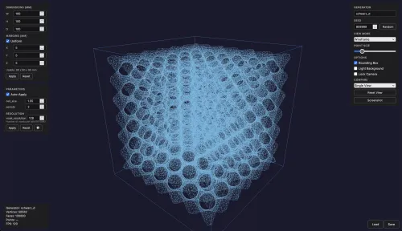
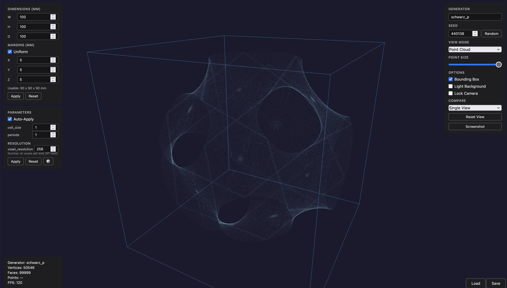
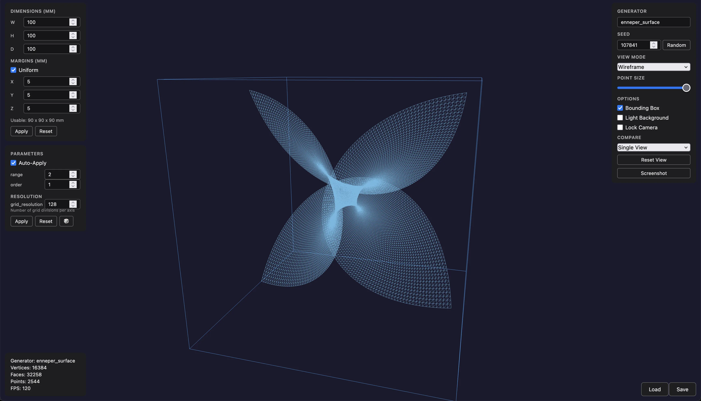

# MathViz

MathViz generates 3D mathematical forms, such as strange attractors, fractals,
knots and minimal surfaces, and prepares them for subsurface laser engraving in
crystal glass blocks. The blocks are mounted on a wall in a grid. Each block
contains a different form, engraved as a monochrome point cloud of
micro-fractures.

<table>
  <tr>
    <td><a href="screenshots/1.png"></a></td>
    <td><a href="screenshots/2.png"></a></td>
    <td><a href="screenshots/3.png"></a></td>
  </tr>
  <tr>
    <td><a href="screenshots/4.png"></a></td>
    <td><a href="screenshots/5.png"></a></td>
    <td><a href="screenshots/6.png"></a></td>
  </tr>
  <tr>
    <td><a href="screenshots/7.png"></a></td>
    <td><a href="screenshots/8.png"></a></td>
    <td><a href="screenshots/9.png"></a></td>
  </tr>
</table>

## Features

- **89 generators** across 12 categories (attractors, fractals, knots, parametric surfaces, and more)
- **Linear pipeline**: Generate → Represent → Transform → Sample → Validate → Export
- **9 representation strategies** that control how a form appears when engraved
- **Deterministic output**: the same seed reproduces the same form
- **Grid manifest**: records the preset assigned to each block position of an installation
- **Interactive 3D preview** in the browser (Three.js, served by FastAPI)
- **High-resolution rendering** to PNG (3D and 2D projections)
- **Configurable containers**: glass block dimensions, margins, and placement policies
- **Sampling profiles**: preview (fast) and production (high-quality)
- **Format conversion**: STL, OBJ, PLY, GLB, XYZ, PCD

## Installation

Requires Python 3.11+.

```bash
pip install .
```

### Optional extras

```bash
# High-resolution 3D/2D rendering (requires PyVista)
pip install ".[render]"

# Development tools (pytest, ruff, httpx)
pip install ".[dev]"
```

## Quickstart

Generate a Lorenz attractor and export to PLY:

```bash
mathviz generate lorenz --output lorenz.ply
```

Open an interactive preview in the browser:

```bash
mathviz preview lorenz
```

List all available generators:

```bash
mathviz list
```

Show a generator's details and parameter schema:

```bash
mathviz info lorenz
```

Override parameters and seed:

```bash
mathviz generate lorenz --param sigma=12 --param rho=30 --seed 7 --output lorenz.ply
```

Generate with the production sampling profile:

```bash
mathviz generate gyroid --profile production --output gyroid.ply
```

## Generators

| Category | Count | Generators | Description |
|---|---|---|---|
| attractors | 10 | `lorenz`, `rossler`, `chen`, `aizawa`, `thomas`, `halvorsen`, `double_pendulum`, `clifford`, `dequan_li`, `sprott` | Strange attractor trajectories |
| curves | 5 | `cardioid`, `fibonacci_spiral`, `hilbert_3d`, `lissajous_curve`, `logarithmic_spiral` | Mathematical curves extended to 3D |
| data_driven | 3 | `building_extrude`, `heightmap`, `soundwave` | Forms derived from external data files |
| fractals | 11 | `apollonian_3d`, `burning_ship`, `fractal_slice`, `ifs_fractal`, `julia3d`, `koch_3d`, `mandelbrot_heightmap`, `mandelbulb`, `menger_sponge`, `quaternion_julia`, `sierpinski_tetrahedron` | 3D fractals and fractal heightmaps |
| geometry | 6 | `gear`, `generic_parametric`, `geodesic_sphere`, `voronoi_3d`, `voronoi_sphere`, `weaire_phelan` | User-defined parametric surfaces, Voronoi, and mechanical forms |
| implicit | 4 | `gyroid`, `schwarz_d`, `schwarz_p`, `genus2_surface` | Triply periodic minimal surfaces via marching cubes |
| knots | 9 | `torus_knot`, `figure_eight_knot`, `lissajous_knot`, `seven_crossing_knots`, `trefoil_on_torus`, `pretzel_knot`, `cinquefoil_knot`, `borromean_rings`, `chain_links` | Mathematical knot curves and linked structures |
| number_theory | 4 | `digit_encoding`, `prime_gaps`, `sacks_spiral`, `ulam_spiral` | Number-theoretic visualizations |
| parametric | 23 | `bour_surface`, `boy_surface`, `calabi_yau`, `costa_surface`, `cross_cap`, `dini_surface`, `dna_helix`, `dupin_cyclide`, `enneper_surface`, `hopf_fibration`, `klein_bottle`, `linked_tori`, `lissajous_surface`, `mobius_strip`, `mobius_trefoil`, `roman_surface`, `rose_surface`, `seifert_surface`, `shell_spiral`, `spherical_harmonics`, `superellipsoid`, `torus`, `twisted_torus` | Parametric surface meshes |
| physics | 7 | `electron_orbital`, `gravitational_lensing`, `kepler_orbit`, `magnetic_field`, `nbody`, `planetary_positions`, `wave_interference` | Physics simulations |
| procedural | 6 | `lsystem`, `noise_surface`, `penrose_3d`, `rd_surface`, `reaction_diffusion`, `terrain` | Procedurally generated surfaces and structures |
| surfaces | 1 | `parabolic_envelope` | Ruled surfaces and envelopes |

See [docs/generators.md](docs/generators.md) for full parameter tables and examples.

## CLI Commands

| Command | Description |
|---|---|
| `mathviz generate` | Run a generator through the full pipeline |
| `mathviz list` | List all available generators |
| `mathviz info` | Show generator details and parameter schema |
| `mathviz validate` | Generate and validate without exporting |
| `mathviz preview` | Start the interactive 3D preview server |
| `mathviz render` | Render a high-resolution 3D PNG |
| `mathviz render-2d` | Render a 2D projection |
| `mathviz render-all` | Render all generators in parallel |
| `mathviz benchmark` | Benchmark pipeline performance |
| `mathviz convert` | Convert geometry between formats |
| `mathviz sample` | Sample a mesh into a point cloud |
| `mathviz transform` | Fit geometry within a container |
| `mathviz schema` | Generate JSON Schema files from config models |
| `mathviz grid init` | Create a new grid manifest |
| `mathviz grid show` | Show the grid |
| `mathviz grid assign` | Assign a preset to a grid position |
| `mathviz grid status` | Show or update block status |
| `mathviz grid neighbors` | Show the 8 blocks around a position |
| `mathviz grid summary` | Show counts by status |
| `mathviz export-demo` | Build a static demo site for deployment |
| `mathviz grid export-all` | Export every assigned block |

See [docs/cli.md](docs/cli.md) for every flag, with examples.

## Documentation

- [Generators](docs/generators.md) — all generator categories with parameter tables and examples
- [Pipeline](docs/pipeline.md) — the Generate → Represent → Transform → Sample → Validate → Export pipeline
- [CLI Reference](docs/cli.md) — every CLI command with flags, options, and examples
- [Configuration](docs/configuration.md) — config file format, precedence rules, sampling profiles
- [Representation Strategies](docs/representation.md) — how a generator's raw geometry becomes the geometry that is engraved
- [Preview UI](docs/preview.md) — interactive 3D preview with comparison mode, snapshots, and keyboard shortcuts
- [Preview UI Reference](docs/preview-ui.md) — every preview control, view mode, and shortcut
- [Rendering](docs/rendering.md) — `render`, `render-2d`, and `render-all` commands, optional dependencies
- [Demo Site](docs/demo.md) — building, previewing, and deploying the static demo gallery
- [Grid Layout](docs/grid.md) — grid manifest format and grid CLI
- [Python API](docs/api.md) — using MathViz as a Python library
- [Writing Style](docs/writing-style.md) — rules for prose in docs, comments, test names, and pull requests

## Testing

```bash
pip install ".[dev]"
pytest
```

## License

~~See LICENSE file for details.~~ The repository has no LICENSE file (checked 2026-09-23).
