# Generators

MathViz includes 89 generators across 12 categories. Each generator produces a deterministic 3D mathematical form from a seed and a set of parameters.

## Table of Contents

- **[Attractors](#attractors)**
  - [aizawa](#aizawa)
  - [chen](#chen)
  - [clifford](#clifford)
  - [dequan_li](#dequan_li)
  - [double_pendulum](#double_pendulum)
  - [halvorsen](#halvorsen)
  - [lorenz](#lorenz)
  - [rossler](#rossler)
  - [sprott](#sprott)
  - [thomas](#thomas)
- **[Curves](#curves)**
  - [cardioid](#cardioid)
  - [fibonacci_spiral](#fibonacci_spiral)
  - [hilbert_3d](#hilbert_3d)
  - [lissajous_curve](#lissajous_curve)
  - [logarithmic_spiral](#logarithmic_spiral)
- **[Data-Driven](#data-driven)**
  - [building_extrude](#building_extrude)
  - [heightmap](#heightmap)
  - [soundwave](#soundwave)
- **[Fractals](#fractals)**
  - [apollonian_3d](#apollonian_3d)
  - [burning_ship](#burning_ship)
  - [fractal_slice](#fractal_slice)
  - [ifs_fractal](#ifs_fractal)
  - [julia3d](#julia3d)
  - [koch_3d](#koch_3d)
  - [mandelbrot_heightmap](#mandelbrot_heightmap)
  - [mandelbulb](#mandelbulb)
  - [menger_sponge](#menger_sponge)
  - [quaternion_julia](#quaternion_julia)
  - [sierpinski_tetrahedron](#sierpinski_tetrahedron)
- **[Geometry](#geometry)**
  - [gear](#gear)
  - [generic_parametric](#generic_parametric)
  - [geodesic_sphere](#geodesic_sphere)
  - [voronoi_3d](#voronoi_3d)
  - [voronoi_sphere](#voronoi_sphere)
  - [weaire_phelan](#weaire_phelan)
- **[Implicit Surfaces](#implicit-surfaces)**
  - [genus2_surface](#genus2_surface)
  - [gyroid](#gyroid)
  - [schwarz_d](#schwarz_d)
  - [schwarz_p](#schwarz_p)
- **[Knots](#knots)**
  - [borromean_rings](#borromean_rings)
  - [chain_links](#chain_links)
  - [cinquefoil_knot](#cinquefoil_knot)
  - [figure_eight_knot](#figure_eight_knot)
  - [lissajous_knot](#lissajous_knot)
  - [pretzel_knot](#pretzel_knot)
  - [seven_crossing_knots](#seven_crossing_knots)
  - [torus_knot](#torus_knot)
  - [trefoil_on_torus](#trefoil_on_torus)
- **[Number Theory](#number-theory)**
  - [digit_encoding](#digit_encoding)
  - [prime_gaps](#prime_gaps)
  - [sacks_spiral](#sacks_spiral)
  - [ulam_spiral](#ulam_spiral)
- **[Parametric Surfaces](#parametric-surfaces)**
  - [bour_surface](#bour_surface)
  - [boy_surface](#boy_surface)
  - [calabi_yau](#calabi_yau)
  - [costa_surface](#costa_surface)
  - [cross_cap](#cross_cap)
  - [dini_surface](#dini_surface)
  - [dna_helix](#dna_helix)
  - [dupin_cyclide](#dupin_cyclide)
  - [enneper_surface](#enneper_surface)
  - [hopf_fibration](#hopf_fibration)
  - [klein_bottle](#klein_bottle)
  - [linked_tori](#linked_tori)
  - [lissajous_surface](#lissajous_surface)
  - [mobius_strip](#mobius_strip)
  - [mobius_trefoil](#mobius_trefoil)
  - [roman_surface](#roman_surface)
  - [rose_surface](#rose_surface)
  - [seifert_surface](#seifert_surface)
  - [shell_spiral](#shell_spiral)
  - [spherical_harmonics](#spherical_harmonics)
  - [superellipsoid](#superellipsoid)
  - [torus](#torus)
  - [twisted_torus](#twisted_torus)
- **[Physics](#physics)**
  - [electron_orbital](#electron_orbital)
  - [gravitational_lensing](#gravitational_lensing)
  - [kepler_orbit](#kepler_orbit)
  - [magnetic_field](#magnetic_field)
  - [nbody](#nbody)
  - [planetary_positions](#planetary_positions)
  - [wave_interference](#wave_interference)
- **[Procedural](#procedural)**
  - [lsystem](#lsystem)
  - [noise_surface](#noise_surface)
  - [penrose_3d](#penrose_3d)
  - [rd_surface](#rd_surface)
  - [reaction_diffusion](#reaction_diffusion)
  - [terrain](#terrain)
- **[Surfaces](#surfaces)**
  - [parabolic_envelope](#parabolic_envelope)

## Attractors

Strange attractor trajectories computed by integrating dynamical systems.

### aizawa

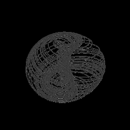

Aizawa torus-like strange attractor trajectory

The Aizawa attractor is a six-parameter dissipative system whose trajectory wraps into a toroidal shape with chaotic surface detail. It exhibits quasi-periodic motion around a central axis.

Aliases: `aizawa_attractor`

Recommended representation: **raw_point_cloud**

Seed behavior: **seed-dependent**

**Parameters:**

| Parameter | Type | Default | Range | Description |
|---|---|---|---|---|
| `a` | float | 0.95 | — | A |
| `b` | float | 0.7 | — | B |
| `c` | float | 0.6 | — | C |
| `d` | float | 3.5 | — | D |
| `e` | float | 0.25 | — | E |
| `f` | float | 0.1 | — | F |
| `transient_steps` | int | 1000 | — | Transient steps |

**Resolution parameters:**

| Parameter | Default | Description |
|---|---|---|
| `integration_steps` | 100000 | Total number of integration time steps |

**Example configurations:**

- Tighter wrapping with more symmetric loops
  ```bash
  mathviz generate aizawa --param a=0.95 --param b=0.7 --param c=0.65 --param d=3.5 --param e=0.25 --param f=0.1 --output aizawa.ply
  ```
- Wider torus with stronger z-axis oscillation
  ```bash
  mathviz generate aizawa --param a=0.8 --param b=0.5 --param c=0.6 --param d=4.0 --param e=0.3 --param f=0.15 --output aizawa.ply
  ```

### chen

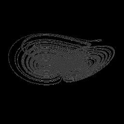

Chen double-scroll strange attractor trajectory

The Chen attractor is a three-parameter ODE system that produces a double-scroll shape. It is closely related to the Lorenz system but with different symmetry properties.

Aliases: `chen_attractor`

Recommended representation: **raw_point_cloud**

Seed behavior: **seed-dependent**

**Parameters:**

| Parameter | Type | Default | Range | Description |
|---|---|---|---|---|
| `a` | float | 35 | — | A |
| `b` | float | 3 | — | B |
| `c` | float | 28 | — | C |
| `transient_steps` | int | 1000 | — | Transient steps |

**Resolution parameters:**

| Parameter | Default | Description |
|---|---|---|
| `integration_steps` | 100000 | Total number of integration time steps |

**Example configurations:**

- Classic double scroll
  ```bash
  mathviz generate chen --param a=35.0 --param b=3.0 --param c=28.0 --output chen.ply
  ```
- Tighter scrolls with higher c
  ```bash
  mathviz generate chen --param a=40.0 --param b=3.0 --param c=33.0 --output chen.ply
  ```

### clifford

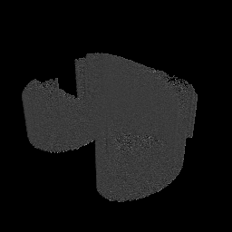

Clifford 2D iterated-map attractor (point cloud)

The Clifford attractor is a 2D iterated map producing fractal dust patterns. Points are generated by iterating x_{n+1} = sin(a·y_n) + c·cos(a·x_n), y_{n+1} = sin(b·x_n) + d·cos(b·y_n), then given z-height from iteration count.

Aliases: `clifford_attractor`

Recommended representation: **sparse_shell**

Seed behavior: **deterministic**

**Parameters:**

| Parameter | Type | Default | Range | Description |
|---|---|---|---|---|
| `a` | float | -1.4 | — | A |
| `b` | float | 1.6 | — | B |
| `c` | float | 1 | — | C |
| `d` | float | 0.7 | — | D |

**Resolution parameters:**

| Parameter | Default | Description |
|---|---|---|
| `num_points` | 500000 | Number of iteration points to generate |

**Example configurations:**

- Delicate feathered wings
  ```bash
  mathviz generate clifford --param a=-1.7 --param b=1.3 --param c=-0.1 --param d=-1.2 --output clifford.ply
  ```
- Dense circular cloud
  ```bash
  mathviz generate clifford --param a=1.5 --param b=-1.8 --param c=1.6 --param d=0.9 --output clifford.ply
  ```

### dequan_li

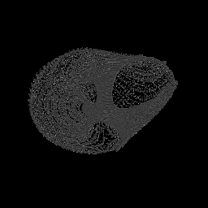

Dequan Li multi-scroll chaotic attractor trajectory

The Dequan Li attractor is a six-parameter chaotic flow that produces multi-scroll shapes. Its trajectory spirals through space creating interlinked loops with complex self-intersection.

Aliases: `dequan_li_attractor`

Recommended representation: **tube**

Seed behavior: **seed-dependent**

**Parameters:**

| Parameter | Type | Default | Range | Description |
|---|---|---|---|---|
| `a` | float | 40 | — | A |
| `c` | float | 1.833 | — | C |
| `d` | float | 0.16 | — | D |
| `e` | float | 0.65 | — | E |
| `f` | float | 20 | — | F |
| `k` | float | 55 | — | K |
| `transient_steps` | int | 1000 | — | Transient steps |

**Resolution parameters:**

| Parameter | Default | Description |
|---|---|---|
| `integration_steps` | 100000 | Total number of integration time steps |

**Example configurations:**

- Default multi-scroll shape
  ```bash
  mathviz generate dequan_li --param a=40.0 --param c=1.833 --param d=0.16 --param e=0.65 --param f=20.0 --param k=55.0 --output dequan_li.ply
  ```

### double_pendulum

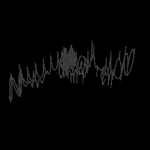

Double pendulum chaotic trajectory (4D phase space → 3D)

A double pendulum is a pendulum with another pendulum attached to its end. Despite simple construction, it exhibits rich chaotic motion. The 4D phase space (two angles, two angular velocities) is projected to 3D.

Aliases: `double_pendulum_attractor`

Recommended representation: **raw_point_cloud**

Seed behavior: **seed-dependent**

Performance: Integration time scales linearly with integration_steps

**Parameters:**

| Parameter | Type | Default | Range | Description |
|---|---|---|---|---|
| `mass` | float | 1 | — | Mass |
| `length` | float | 1 | — | Length |
| `gravity` | float | 9.81 | — | Gravity |
| `theta1` | float | 2.5 | — | Theta1 |
| `theta2` | float | 2 | — | Theta2 |
| `omega1` | float | 0 | — | Omega1 |
| `omega2` | float | 0 | — | Omega2 |
| `transient_steps` | int | 500 | — | Transient steps |

**Resolution parameters:**

| Parameter | Default | Description |
|---|---|---|
| `integration_steps` | 100000 | Total number of integration time steps |

**Example configurations:**

- Wide chaotic sweep from near-vertical start
  ```bash
  mathviz generate double_pendulum --param theta1=3.0 --param theta2=2.5 --param mass=1.0 --param length=1.0 --output double_pendulum.ply
  ```
- Gentler motion with lower initial angles
  ```bash
  mathviz generate double_pendulum --param theta1=1.5 --param theta2=1.0 --param mass=1.0 --param length=1.0 --output double_pendulum.ply
  ```

### halvorsen

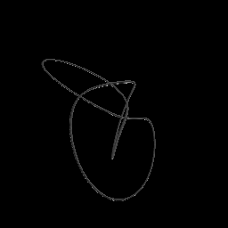

Halvorsen three-winged strange attractor trajectory

The Halvorsen attractor is a single-parameter system producing a three-winged shape with cyclic symmetry. Each wing spirals outward before folding back toward the center.

Aliases: `halvorsen_attractor`

Recommended representation: **raw_point_cloud**

Seed behavior: **seed-dependent**

**Parameters:**

| Parameter | Type | Default | Range | Description |
|---|---|---|---|---|
| `a` | float | 1.89 | — | A |
| `transient_steps` | int | 1000 | — | Transient steps |

**Resolution parameters:**

| Parameter | Default | Description |
|---|---|---|
| `integration_steps` | 100000 | Total number of integration time steps |

**Example configurations:**

- Classic three-winged shape
  ```bash
  mathviz generate halvorsen --param a=1.89 --output halvorsen.ply
  ```
- Wider wings with lower damping
  ```bash
  mathviz generate halvorsen --param a=1.4 --output halvorsen.ply
  ```

### lorenz

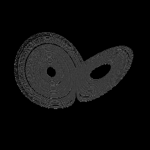

Lorenz strange attractor trajectory

The Lorenz system is the canonical strange attractor, arising from a simplified model of atmospheric convection. Its famous butterfly-shaped trajectory never repeats and is highly sensitive to initial conditions.

Aliases: `lorenz_attractor`

Recommended representation: **tube**

Seed behavior: **seed-dependent**

**Parameters:**

| Parameter | Type | Default | Range | Description |
|---|---|---|---|---|
| `sigma` | float | 10 | 5.0–20.0 (step 0.5) | Sigma |
| `rho` | float | 28 | 15.0–50.0 (step 0.5) | Rho |
| `beta` | float | 2.66667 | 0.5–5.0 (step 0.1) | Beta |
| `transient_steps` | int | 1000 | 0–5000 (step 100) | Transient steps |

**Resolution parameters:**

| Parameter | Default | Description |
|---|---|---|
| `integration_steps` | 100000 | Total number of integration time steps |

**Example configurations:**

- Classic butterfly with standard parameters
  ```bash
  mathviz generate lorenz --param sigma=10.0 --param rho=28.0 --param beta=2.667 --output lorenz.ply
  ```
- Wider butterfly wings with higher Rayleigh number
  ```bash
  mathviz generate lorenz --param sigma=10.0 --param rho=45.0 --param beta=2.667 --output lorenz.ply
  ```
- Tighter spiral with lower sigma
  ```bash
  mathviz generate lorenz --param sigma=6.0 --param rho=28.0 --param beta=2.667 --output lorenz.ply
  ```

### rossler

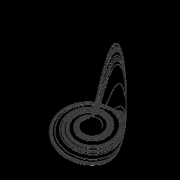

Rössler strange attractor trajectory

The Rössler attractor is a three-parameter ODE system producing a single-scroll shape that resembles a folded band. It was designed to exhibit the simplest possible chaotic behavior.

Aliases: `rossler_attractor`

Recommended representation: **raw_point_cloud**

Seed behavior: **seed-dependent**

**Parameters:**

| Parameter | Type | Default | Range | Description |
|---|---|---|---|---|
| `a` | float | 0.2 | — | A |
| `b` | float | 0.2 | — | B |
| `c` | float | 5.7 | — | C |
| `transient_steps` | int | 1000 | — | Transient steps |

**Resolution parameters:**

| Parameter | Default | Description |
|---|---|---|
| `integration_steps` | 100000 | Total number of integration time steps |

**Example configurations:**

- Classic single fold band
  ```bash
  mathviz generate rossler --param a=0.2 --param b=0.2 --param c=5.7 --output rossler.ply
  ```
- Funnel-shaped with higher c
  ```bash
  mathviz generate rossler --param a=0.2 --param b=0.2 --param c=18.0 --output rossler.ply
  ```

### sprott

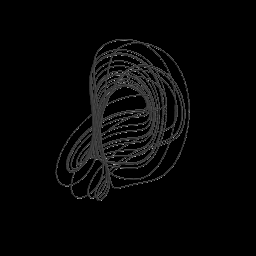

Sprott minimal chaotic flows (multiple variants)

Sprott's minimal chaotic flows are a family of simple 3D ODE systems, each with the fewest possible terms to produce chaos. Different variants (sprott_a through sprott_s) have distinct topologies.

Aliases: `sprott_attractor`

Recommended representation: **tube**

Seed behavior: **seed-dependent**

**Parameters:**

| Parameter | Type | Default | Range | Description |
|---|---|---|---|---|
| `system` | str | `"sprott_a"` | — | System |
| `transient_steps` | int | 1000 | — | Transient steps |

**Resolution parameters:**

| Parameter | Default | Description |
|---|---|---|
| `integration_steps` | 100000 | Total number of integration time steps |

**Example configurations:**

- Sprott case A — simplest chaotic flow
  ```bash
  mathviz generate sprott --param system=sprott_a --output sprott.ply
  ```
- Sprott case B — two-scroll variant
  ```bash
  mathviz generate sprott --param system=sprott_b --output sprott.ply
  ```

### thomas

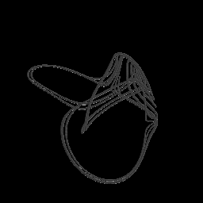

Thomas cyclically symmetric strange attractor trajectory

The Thomas attractor is a cyclically symmetric system with a single dissipation parameter b. As b decreases the system transitions from fixed points through limit cycles to chaotic behavior.

Aliases: `thomas_attractor`

Recommended representation: **raw_point_cloud**

Seed behavior: **seed-dependent**

**Parameters:**

| Parameter | Type | Default | Range | Description |
|---|---|---|---|---|
| `b` | float | 0.208186 | — | B |
| `transient_steps` | int | 1000 | — | Transient steps |

**Resolution parameters:**

| Parameter | Default | Description |
|---|---|---|
| `integration_steps` | 100000 | Total number of integration time steps |

**Example configurations:**

- Standard chaotic regime
  ```bash
  mathviz generate thomas --param b=0.208186 --output thomas.ply
  ```
- Near the edge of chaos — more regular loops
  ```bash
  mathviz generate thomas --param b=0.18 --output thomas.ply
  ```

## Curves

3D curves with configurable shape and resolution.

### cardioid

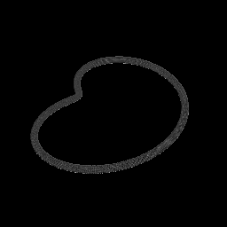

Heart-shaped cardioid curve extended to 3D

A cardioid is a heart-shaped curve traced by a point on a circle rolling around a fixed circle of equal radius. Here it is extended into 3D with a configurable z-height.

Recommended representation: **tube**

Seed behavior: **deterministic**

**Parameters:**

| Parameter | Type | Default | Range | Description |
|---|---|---|---|---|
| `radius` | float | 1 | — | Radius |
| `height` | float | 0.3 | — | Height |

**Resolution parameters:**

| Parameter | Default | Description |
|---|---|---|
| `curve_points` | 1024 | Number of sample points along the curve |

**Example configurations:**

- Flat heart shape
  ```bash
  mathviz generate cardioid --param radius=1.0 --param height=0.0 --output cardioid.ply
  ```
- Tall helix-like cardioid
  ```bash
  mathviz generate cardioid --param radius=1.0 --param height=1.5 --output cardioid.ply
  ```

### fibonacci_spiral

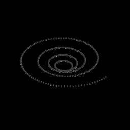

Golden-ratio spiral with exponential radius growth

A golden-ratio spiral whose radius grows exponentially with the golden ratio φ ≈ 1.618. It is the spiral found in sunflower seed heads, nautilus shells, and galaxy arms.

Aliases: `golden_spiral`

Recommended representation: **tube**

Seed behavior: **deterministic**

**Parameters:**

| Parameter | Type | Default | Range | Description |
|---|---|---|---|---|
| `turns` | float | 4 | — | Turns |
| `height` | float | 0.5 | — | Height |
| `scale` | float | 1 | — | Scale |

**Resolution parameters:**

| Parameter | Default | Description |
|---|---|---|
| `curve_points` | 1024 | Number of sample points along the spiral |

**Example configurations:**

- Tight spiral with many turns
  ```bash
  mathviz generate fibonacci_spiral --param turns=8.0 --param height=0.2 --param scale=1.0 --output fibonacci_spiral.ply
  ```
- Wide 3D helix
  ```bash
  mathviz generate fibonacci_spiral --param turns=3.0 --param height=2.0 --param scale=1.0 --output fibonacci_spiral.ply
  ```

### hilbert_3d

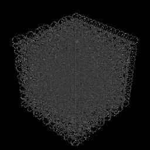

3D Hilbert space-filling curve visiting every grid cell

The 3D Hilbert curve is a space-filling curve that visits every cell in an N×N×N grid exactly once. Higher orders fill space more densely, producing a complex self-similar labyrinth.

Aliases: `hilbert_curve_3d`

Recommended representation: **tube**

Seed behavior: **deterministic**

Performance: Vertex count is 8^order; order 5 = 32768 vertices

**Parameters:**

| Parameter | Type | Default | Range | Description |
|---|---|---|---|---|
| `order` | int | 4 | — | Order |
| `size` | float | 1 | — | Size |

**Example configurations:**

- Low-order curve showing basic structure
  ```bash
  mathviz generate hilbert_3d --param order=2 --param size=1.0 --output hilbert_3d.ply
  ```
- Dense space-filling at order 5
  ```bash
  mathviz generate hilbert_3d --param order=5 --param size=1.0 --output hilbert_3d.ply
  ```

### lissajous_curve

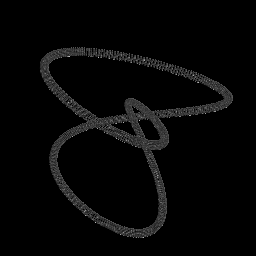

3D Lissajous curve with configurable frequencies and phases

A 3D Lissajous curve is the trajectory of a point whose x, y, z coordinates oscillate sinusoidally at different frequencies and phases. Integer frequency ratios produce closed curves.

Recommended representation: **tube**

Seed behavior: **deterministic**

**Parameters:**

| Parameter | Type | Default | Range | Description |
|---|---|---|---|---|
| `nx` | int | 3 | — | Nx |
| `ny` | int | 2 | — | Ny |
| `nz` | int | 1 | — | Nz |
| `phase_x` | float | 0 | — | Phase x |
| `phase_y` | float | 0.5 | — | Phase y |
| `phase_z` | float | 0 | — | Phase z |
| `scale` | float | 1 | — | Scale |

**Resolution parameters:**

| Parameter | Default | Description |
|---|---|---|
| `curve_points` | 1024 | Number of sample points along the curve |

**Example configurations:**

- Classic figure-8 projection
  ```bash
  mathviz generate lissajous_curve --param nx=2 --param ny=3 --param nz=1 --param phase_x=0.0 --param phase_y=0.5 --param phase_z=0.0 --output lissajous_curve.ply
  ```
- Complex 3D knot-like path
  ```bash
  mathviz generate lissajous_curve --param nx=3 --param ny=5 --param nz=7 --param phase_x=0.0 --param phase_y=0.3 --param phase_z=0.7 --output lissajous_curve.ply
  ```

### logarithmic_spiral

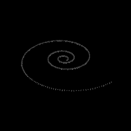

Logarithmic spiral with exponential radius growth

A logarithmic (equiangular) spiral whose radius grows exponentially, extended into 3D with a rising z component. Appears widely in nature from shells to hurricanes.

Recommended representation: **tube**

Seed behavior: **deterministic**

**Parameters:**

| Parameter | Type | Default | Range | Description |
|---|---|---|---|---|
| `growth_rate` | float | 0.15 | — | Growth rate |
| `turns` | float | 3 | — | Turns |
| `height` | float | 1 | — | Height |
| `scale` | float | 1 | — | Scale |

**Resolution parameters:**

| Parameter | Default | Description |
|---|---|---|
| `curve_points` | 1024 | Number of sample points along the spiral |

**Example configurations:**

- Tight fast-growing spiral
  ```bash
  mathviz generate logarithmic_spiral --param growth_rate=0.3 --param turns=2.0 --param height=0.5 --output logarithmic_spiral.ply
  ```
- Gentle long spiral
  ```bash
  mathviz generate logarithmic_spiral --param growth_rate=0.08 --param turns=6.0 --param height=2.0 --output logarithmic_spiral.ply
  ```

## Data-Driven

Generators that read external data files to produce geometry.

### building_extrude

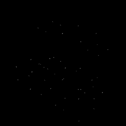

Extrude GeoJSON polygons into 3D building meshes

Reads GeoJSON building footprint polygons and extrudes them vertically to create a 3D cityscape. Height comes from a property field or a configurable default.

Recommended representation: **surface_shell**

Seed behavior: **deterministic**

**Parameters:**

| Parameter | Type | Default | Range | Description |
|---|---|---|---|---|
| `input_file` | str | `""` | — | Input file |
| `default_height` | float | 1 | — | Default height |
| `height_property` | str | `"height"` | — | Height property |

**Example configurations:**

- Default extrusion with 1.0 unit height
  ```bash
  mathviz generate building_extrude --param default_height=1.0 --param height_property=height --output building_extrude.ply
  ```

### heightmap

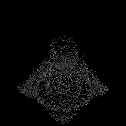

Heightmap relief from image or GeoTIFF file

Converts a grayscale image or GeoTIFF raster into a 3D relief surface. Pixel brightness maps directly to z-height, producing terrain-like meshes from any image.

Aliases: `heightmap_image`

Recommended representation: **heightmap_relief**

Seed behavior: **deterministic**

**Parameters:**

| Parameter | Type | Default | Range | Description |
|---|---|---|---|---|
| `input_file` | str | `""` | — | Input file |
| `height_scale` | float | 1 | — | Height scale |
| `downsample` | int | 1 | — | Downsample |

**Example configurations:**

- Standard height scale
  ```bash
  mathviz generate heightmap --param height_scale=1.0 --param downsample=1 --output heightmap.ply
  ```
- Exaggerated relief
  ```bash
  mathviz generate heightmap --param height_scale=3.0 --param downsample=2 --output heightmap.ply
  ```

### soundwave

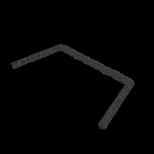

3D waveform visualization from WAV audio file

Reads a WAV audio file and generates a 3D ribbon representing the amplitude envelope over time. The waveform is smoothed and extruded along a path.

Aliases: `audio_waveform`

Recommended representation: **tube**

Seed behavior: **deterministic**

**Parameters:**

| Parameter | Type | Default | Range | Description |
|---|---|---|---|---|
| `input_file` | str | `""` | — | Input file |
| `amplitude_scale` | float | 1 | — | Amplitude scale |
| `length` | float | 2 | — | Length |

**Resolution parameters:**

| Parameter | Default | Description |
|---|---|---|
| `num_samples` | 2048 | Number of envelope sample points |

**Example configurations:**

- Default amplitude visualization
  ```bash
  mathviz generate soundwave --param amplitude_scale=1.0 --param length=2.0 --output soundwave.ply
  ```

## Fractals

Self-similar structures from recursive or escape-time algorithms.

### apollonian_3d

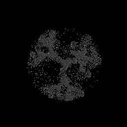

3D Apollonian gasket via recursive Soddy sphere packing

The 3D Apollonian gasket fills space with tangent spheres using recursive Soddy sphere packing. Each generation fits new spheres into the interstices of existing ones, creating a fractal foam.

Aliases: `apollonian_gasket_3d`

Recommended representation: **surface_shell**

Seed behavior: **deterministic**

Performance: Sphere count grows exponentially with max_depth

**Parameters:**

| Parameter | Type | Default | Range | Description |
|---|---|---|---|---|
| `max_depth` | int | 5 | 0–8 (step 1) | Max depth |
| `min_radius` | float | 0.01 | 0.001–0.1 (step 0.005) | Min radius |

**Resolution parameters:**

| Parameter | Default | Description |
|---|---|---|
| `icosphere_subdivisions` | 1 | Subdivision level for each sphere mesh |

**Example configurations:**

- Dense packing with small spheres
  ```bash
  mathviz generate apollonian_3d --param max_depth=6 --param min_radius=0.005 --output apollonian_3d.ply
  ```
- Coarse packing showing structure
  ```bash
  mathviz generate apollonian_3d --param max_depth=3 --param min_radius=0.05 --output apollonian_3d.ply
  ```

### burning_ship

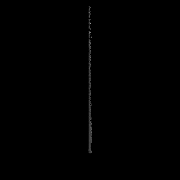

Burning Ship escape-time heightmap for 3D relief engraving

The Burning Ship fractal uses absolute-value versions of the Mandelbrot iteration, producing a shape reminiscent of a burning galleon. Rendered as a heightmap with escape-time values as z-height.

Recommended representation: **heightmap_relief**

Seed behavior: **deterministic**

**Parameters:**

| Parameter | Type | Default | Range | Description |
|---|---|---|---|---|
| `center_x` | float | -0.4 | — | Center x |
| `center_y` | float | -0.6 | — | Center y |
| `zoom` | float | 3 | — | Zoom |
| `max_iterations` | int | 256 | — | Max iterations |
| `height_scale` | float | 0.3 | — | Height scale |

**Resolution parameters:**

| Parameter | Default | Description |
|---|---|---|
| `pixel_resolution` | 512 | Grid points per axis (N² cost) |

**Example configurations:**

- Full overview of the ship
  ```bash
  mathviz generate burning_ship --param center_x=-0.4 --param center_y=-0.6 --param zoom=3.0 --output burning_ship.ply
  ```
- Zoomed into the bow detail
  ```bash
  mathviz generate burning_ship --param center_x=-1.76 --param center_y=-0.028 --param zoom=0.05 --output burning_ship.ply
  ```

### fractal_slice

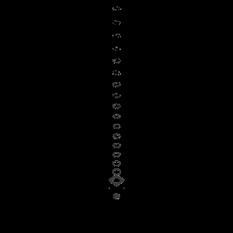

2D cross-section through a Mandelbulb for heightmap relief

Takes a 2D cross-section through a 3D Mandelbulb, producing a heightmap of escape-time values. Different slice positions and axes reveal different internal symmetries of the fractal.

Aliases: `fractal_cross_section`

Recommended representation: **heightmap_relief**

Seed behavior: **deterministic**

**Parameters:**

| Parameter | Type | Default | Range | Description |
|---|---|---|---|---|
| `power` | float | 8 | — | Power |
| `max_iterations` | int | 20 | — | Max iterations |
| `extent` | float | 1.5 | — | Extent |
| `slice_axis` | str | `"z"` | — | Slice axis |
| `slice_position` | float | 0 | — | Slice position |

**Resolution parameters:**

| Parameter | Default | Description |
|---|---|---|
| `pixel_resolution` | 256 | Grid points per axis (N² cost) |

**Example configurations:**

- Equatorial cross-section
  ```bash
  mathviz generate fractal_slice --param slice_axis=z --param slice_position=0.0 --param power=8.0 --output fractal_slice.ply
  ```
- Off-center slice showing asymmetry
  ```bash
  mathviz generate fractal_slice --param slice_axis=y --param slice_position=0.5 --param power=8.0 --output fractal_slice.ply
  ```

### ifs_fractal

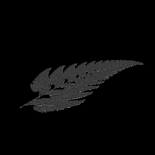

IFS fractal generator (Barnsley fern, maple leaf, spiral, custom)

Iterated Function System fractals are generated by randomly applying affine transformations to a point (the "chaos game"). Different presets produce ferns, spirals, leaves, and other organic shapes.

Aliases: `ifs`, `barnsley_fern`

Recommended representation: **sparse_shell**

Seed behavior: **seed-dependent**

Performance: O(num_points) — linear in iteration count

**Parameters:**

| Parameter | Type | Default | Range | Description |
|---|---|---|---|---|
| `preset` | str | `"barnsley_fern"` | — | Preset |
| `dimensions` | str | `"3d"` | — | Dimensions |

**Resolution parameters:**

| Parameter | Default | Description |
|---|---|---|
| `num_points` | 500000 | Number of chaos-game points to generate |

**Example configurations:**

- Classic Barnsley fern
  ```bash
  mathviz generate ifs_fractal --param preset=barnsley_fern --param dimensions=3d --output ifs_fractal.ply
  ```
- Spiral IFS pattern
  ```bash
  mathviz generate ifs_fractal --param preset=spiral --param dimensions=3d --output ifs_fractal.ply
  ```

### julia3d

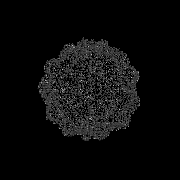

3D Julia set fractal with numba-JIT escape-time kernel

The 3D Julia set extends the classical complex Julia set into three dimensions using a triplex number iteration. The resulting fractal has bulbous, coral-like morphology.

Aliases: `julia_3d`

Recommended representation: **sparse_shell**

Seed behavior: **deterministic**

Performance: O(N³) in voxel_resolution

**Parameters:**

| Parameter | Type | Default | Range | Description |
|---|---|---|---|---|
| `power` | float | 8 | — | Power |
| `max_iterations` | int | 10 | — | Max iterations |
| `extent` | float | 1.5 | — | Extent |
| `c_re` | float | -0.2 | — | C re |
| `c_im` | float | 0.6 | — | C im |
| `c_z` | float | 0.2 | — | C z |

**Resolution parameters:**

| Parameter | Default | Description |
|---|---|---|
| `voxel_resolution` | 128 | Voxels per axis (N³ cost) |

**Example configurations:**

- Coral-like default Julia set
  ```bash
  mathviz generate julia3d --param power=8.0 --param c_re=-0.2 --param c_im=0.6 --param c_z=0.2 --output julia3d.ply
  ```
- Spikier variant with lower power
  ```bash
  mathviz generate julia3d --param power=4.0 --param c_re=-0.4 --param c_im=0.6 --param c_z=0.0 --output julia3d.ply
  ```

### koch_3d

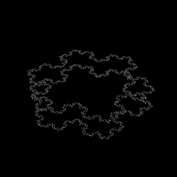

Koch snowflake curve extruded or revolved into 3D

The Koch snowflake is a classic fractal curve built by recursively adding triangular bumps to each edge. Here it is extended to 3D by extrusion or revolution around its center.

Aliases: `koch_snowflake_3d`

Recommended representation: **surface_shell**

Seed behavior: **deterministic**

**Parameters:**

| Parameter | Type | Default | Range | Description |
|---|---|---|---|---|
| `level` | int | 4 | 0–6 (step 1) | Level |
| `mode` | str | `"extrude"` | — | Mode |
| `height` | float | 0.3 | 0.05–2.0 (step 0.05) | Height |

**Example configurations:**

- Extruded snowflake
  ```bash
  mathviz generate koch_3d --param level=4 --param mode=extrude --param height=0.3 --output koch_3d.ply
  ```
- Revolved snowflake — vase-like shape
  ```bash
  mathviz generate koch_3d --param level=3 --param mode=revolve --param height=0.3 --output koch_3d.ply
  ```

### mandelbrot_heightmap

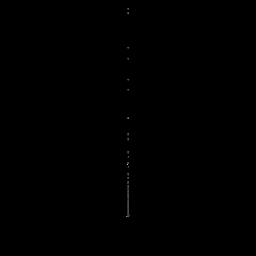

Mandelbrot escape-time heightmap for 3D relief engraving

The Mandelbrot set boundary rendered as a 3D heightmap where escape iteration count maps to z-height. Smooth coloring via fractional escape produces continuous terrain.

Recommended representation: **heightmap_relief**

Seed behavior: **deterministic**

**Parameters:**

| Parameter | Type | Default | Range | Description |
|---|---|---|---|---|
| `center_real` | float | -0.5 | — | Center real |
| `center_imag` | float | 0 | — | Center imag |
| `zoom` | float | 1 | — | Zoom |
| `max_iterations` | int | 256 | — | Max iterations |
| `height_scale` | float | 1 | — | Height scale |
| `smoothing` | bool | True | — | Smoothing |

**Resolution parameters:**

| Parameter | Default | Description |
|---|---|---|
| `pixel_resolution` | 512 | Grid points per axis (N² cost) |

**Example configurations:**

- Full set overview
  ```bash
  mathviz generate mandelbrot_heightmap --param center_real=-0.5 --param center_imag=0.0 --param zoom=1.0 --output mandelbrot_heightmap.ply
  ```
- Seahorse valley zoom
  ```bash
  mathviz generate mandelbrot_heightmap --param center_real=-0.745 --param center_imag=0.186 --param zoom=0.01 --output mandelbrot_heightmap.ply
  ```

### mandelbulb

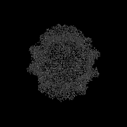

Mandelbulb 3D fractal with numba-JIT escape-time kernel

The Mandelbulb is the best-known 3D generalization of the Mandelbrot set, using a spherical coordinate power formula. The power parameter controls the number of bulbs — power 8 is the classic shape.

Recommended representation: **sparse_shell**

Seed behavior: **deterministic**

Performance: O(N³) in voxel_resolution — 128³ ≈ 2M voxels

**Parameters:**

| Parameter | Type | Default | Range | Description |
|---|---|---|---|---|
| `power` | float | 8 | 2.0–16.0 (step 0.5) | Power |
| `max_iterations` | int | 10 | 3–30 (step 1) | Max iterations |
| `extent` | float | 1.5 | 0.8–2.5 (step 0.1) | Extent |

**Resolution parameters:**

| Parameter | Default | Description |
|---|---|---|
| `voxel_resolution` | 128 | Voxels per axis (N³ cost) |

**Example configurations:**

- Classic power-8 Mandelbulb
  ```bash
  mathviz generate mandelbulb --param power=8.0 --param max_iterations=10 --output mandelbulb.ply
  ```
- Smoother low-power blob
  ```bash
  mathviz generate mandelbulb --param power=3.0 --param max_iterations=15 --output mandelbulb.ply
  ```
- High detail with more iterations
  ```bash
  mathviz generate mandelbulb --param power=8.0 --param max_iterations=25 --output mandelbulb.ply
  ```

### menger_sponge

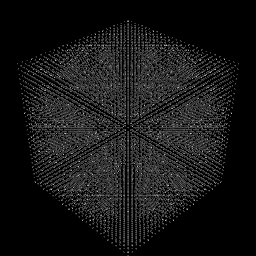

Menger sponge fractal via recursive cube subdivision

The Menger sponge is built by recursively removing the center and face-centers of each cube. Each level multiplies the cube count by 20, converging to a fractal of Hausdorff dimension ≈ 2.727.

Aliases: `menger`

Recommended representation: **surface_shell**

Seed behavior: **deterministic**

Performance: Cube count is 20^level; level 4 = 160,000 cubes

**Parameters:**

| Parameter | Type | Default | Range | Description |
|---|---|---|---|---|
| `level` | int | 3 | 0–4 (step 1) | Level |
| `size` | float | 1 | 0.1–5.0 (step 0.1) | Size |

**Example configurations:**

- Standard level 3 sponge
  ```bash
  mathviz generate menger_sponge --param level=3 --param size=1.0 --output menger_sponge.ply
  ```
- High-detail level 4
  ```bash
  mathviz generate menger_sponge --param level=4 --param size=1.0 --output menger_sponge.ply
  ```

### quaternion_julia

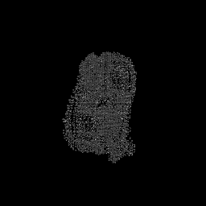

Quaternion Julia set — 4D fractal sliced to 3D

The quaternion Julia set extends Julia fractals to four dimensions using quaternion multiplication, then slices back to 3D. The four c-components control the shape's morphology.

Aliases: `qjulia`

Recommended representation: **surface_shell**

Seed behavior: **deterministic**

Performance: O(N³) in voxel_resolution

**Parameters:**

| Parameter | Type | Default | Range | Description |
|---|---|---|---|---|
| `c_real` | float | -0.2 | -2.0–2.0 (step 0.05) | C real |
| `c_i` | float | 0.8 | -2.0–2.0 (step 0.05) | C i |
| `c_j` | float | 0 | -2.0–2.0 (step 0.05) | C j |
| `c_k` | float | 0 | -2.0–2.0 (step 0.05) | C k |
| `max_iterations` | int | 10 | 3–30 (step 1) | Max iterations |
| `escape_radius` | float | 2 | 1.0–10.0 (step 0.5) | Escape radius |
| `extent` | float | 1.5 | — | Extent |
| `slice_w` | float | 0 | -1.0–1.0 (step 0.05) | Slice w |

**Resolution parameters:**

| Parameter | Default | Description |
|---|---|---|
| `voxel_resolution` | 128 | Voxels per axis (N³ cost) |

**Example configurations:**

- Smooth organic blob
  ```bash
  mathviz generate quaternion_julia --param c_real=-0.2 --param c_i=0.8 --param c_j=0.0 --param c_k=0.0 --output quaternion_julia.ply
  ```
- Spiny variant
  ```bash
  mathviz generate quaternion_julia --param c_real=-0.4 --param c_i=0.6 --param c_j=0.2 --param c_k=-0.1 --output quaternion_julia.ply
  ```

### sierpinski_tetrahedron

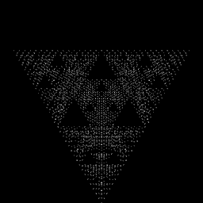

Sierpinski tetrahedron fractal via recursive corner subdivision

The Sierpinski tetrahedron (tetrix) is built by recursively placing four half-scale copies at each corner of a tetrahedron. It has Hausdorff dimension 2 and a striking triangular fractal structure.

Aliases: `tetrix`, `sierpinski_tetrix`

Recommended representation: **surface_shell**

Seed behavior: **deterministic**

Performance: Tetrahedron count is 4^level; level 7 = 16,384

**Parameters:**

| Parameter | Type | Default | Range | Description |
|---|---|---|---|---|
| `level` | int | 5 | 0–8 (step 1) | Level |
| `size` | float | 1 | 0.1–5.0 (step 0.1) | Size |

**Example configurations:**

- Standard tetrix
  ```bash
  mathviz generate sierpinski_tetrahedron --param level=5 --param size=1.0 --output sierpinski_tetrahedron.ply
  ```
- High detail
  ```bash
  mathviz generate sierpinski_tetrahedron --param level=7 --param size=1.0 --output sierpinski_tetrahedron.ply
  ```

## Geometry

Geometric primitives and constructions.

### gear

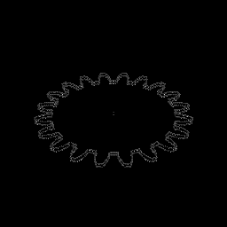

Involute gear: mechanical gear tooth profiles extruded as spur or helical gear solids

An involute spur or helical gear generated from mechanical parameters. The tooth profile follows the involute of a circle, the standard form used in mechanical engineering.

Recommended representation: **surface_shell**

Seed behavior: **deterministic**

**Parameters:**

| Parameter | Type | Default | Range | Description |
|---|---|---|---|---|
| `num_teeth` | int | 20 | — | Num teeth |
| `module` | float | 1 | — | Module |
| `pressure_angle` | float | 20 | — | Pressure angle |
| `face_width` | float | 0.5 | — | Face width |
| `helix_angle` | float | 0 | — | Helix angle |
| `curve_points` | int | 32 | — | Curve points |

**Example configurations:**

- Standard 20-tooth spur gear
  ```bash
  mathviz generate gear --param num_teeth=20 --param module=1.0 --param pressure_angle=20.0 --param face_width=0.5 --output gear.ply
  ```
- Helical gear with 30° helix angle
  ```bash
  mathviz generate gear --param num_teeth=24 --param module=0.8 --param helix_angle=30.0 --param face_width=0.8 --output gear.ply
  ```

### generic_parametric

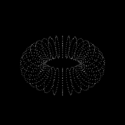

Parametric surface from user-supplied f(u,v) expressions

A parametric surface defined by user-supplied mathematical expressions for x(u,v), y(u,v), z(u,v). Supports standard math functions like sin, cos, exp. Defaults to a torus shape.

Recommended representation: **surface_shell**

Seed behavior: **deterministic**

**Parameters:**

| Parameter | Type | Default | Range | Description |
|---|---|---|---|---|
| `x_expr` | str | `"(1 + 0.4 * cos(v)) * cos(u)"` | — | X expr |
| `y_expr` | str | `"(1 + 0.4 * cos(v)) * sin(u)"` | — | Y expr |
| `z_expr` | str | `"0.4 * sin(v)"` | — | Z expr |
| `u_range` | list | `[0.0, 6.283185307179586]` | — | U range |
| `v_range` | list | `[0.0, 6.283185307179586]` | — | V range |
| `wrap_u` | bool | True | — | Wrap u |
| `wrap_v` | bool | True | — | Wrap v |

**Resolution parameters:**

| Parameter | Default | Description |
|---|---|---|
| `grid_resolution` | 64 | Number of grid divisions per axis |

**Example configurations:**

- Sphere from parametric equations
  ```bash
  mathviz generate generic_parametric --param x_expr=sin(u) * cos(v) --param y_expr=sin(u) * sin(v) --param z_expr=cos(u) --param u_range=[0.0, 3.14159] --param v_range=[0.0, 6.28318] --param wrap_u=False --param wrap_v=True --output generic_parametric.ply
  ```

### geodesic_sphere

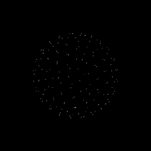

Geodesic sphere: triangulated sphere at various subdivision frequencies, with optional dual (Goldberg) polyhedron mode

A geodesic sphere created by subdividing an icosahedron and projecting vertices onto a sphere. Higher frequency produces more uniform triangulation. Dual mode produces a Goldberg polyhedron.

Recommended representation: **surface_shell**

Seed behavior: **deterministic**

**Parameters:**

| Parameter | Type | Default | Range | Description |
|---|---|---|---|---|
| `frequency` | int | 4 | — | Frequency |
| `radius` | float | 1 | — | Radius |
| `dual` | bool | False | — | Dual |

**Example configurations:**

- Low-poly geodesic sphere
  ```bash
  mathviz generate geodesic_sphere --param frequency=2 --param radius=1.0 --output geodesic_sphere.ply
  ```
- Goldberg polyhedron (dual)
  ```bash
  mathviz generate geodesic_sphere --param frequency=4 --param radius=1.0 --param dual=True --output geodesic_sphere.ply
  ```

### voronoi_3d

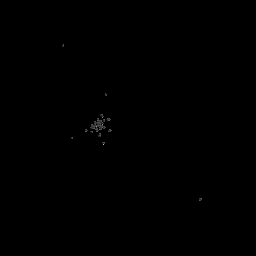

3D Voronoi cell boundaries as wireframe edges

3D Voronoi diagram computed from random seed points. The output is the wireframe edges of the Voronoi cells, revealing the spatial partitioning structure.

Recommended representation: **wireframe**

Seed behavior: **seed-dependent**

**Parameters:**

| Parameter | Type | Default | Range | Description |
|---|---|---|---|---|
| `num_points` | int | 20 | — | Num points |
| `scale` | float | 1 | — | Scale |

**Example configurations:**

- Sparse cells showing large volumes
  ```bash
  mathviz generate voronoi_3d --param num_points=10 --param scale=1.0 --output voronoi_3d.ply
  ```
- Dense honeycomb-like partition
  ```bash
  mathviz generate voronoi_3d --param num_points=50 --param scale=1.0 --output voronoi_3d.ply
  ```

### voronoi_sphere

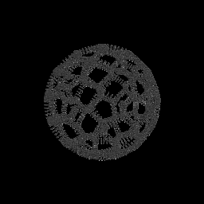

Voronoi tessellation on a sphere surface with geodesic cells

Voronoi tessellation computed on the surface of a sphere using geodesic distances. Produces polygonal cells covering the sphere, similar to organic bubble patterns.

Recommended representation: **tube**

Seed behavior: **seed-dependent**

**Parameters:**

| Parameter | Type | Default | Range | Description |
|---|---|---|---|---|
| `num_cells` | int | 64 | — | Num cells |
| `radius` | float | 1 | — | Radius |
| `edge_width` | float | 0.05 | — | Edge width |
| `edge_height` | float | 0.1 | — | Edge height |
| `cell_style` | str | `"ridges_only"` | — | Cell style |

**Resolution parameters:**

| Parameter | Default | Description |
|---|---|---|
| `arc_resolution` | 16 | Points per great-circle arc segment |

**Example configurations:**

- Coarse cells on a sphere
  ```bash
  mathviz generate voronoi_sphere --param num_cells=12 --output voronoi_sphere.ply
  ```
- Fine tessellation
  ```bash
  mathviz generate voronoi_sphere --param num_cells=128 --output voronoi_sphere.ply
  ```

### weaire_phelan

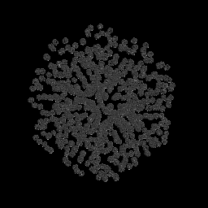

Weaire-Phelan foam: optimal equal-volume space partition

The Weaire-Phelan structure is the best known solution to the Kelvin problem of partitioning space into equal-volume cells with minimal surface area. It uses two cell types: dodecahedra and tetrakaidecahedra.

Recommended representation: **tube**

Seed behavior: **deterministic**

**Parameters:**

| Parameter | Type | Default | Range | Description |
|---|---|---|---|---|
| `cells_per_axis` | int | 2 | — | Cells per axis |
| `edge_only` | bool | True | — | Edge only |

**Example configurations:**

- Single unit cell
  ```bash
  mathviz generate weaire_phelan  --output weaire_phelan.ply
  ```

## Implicit Surfaces

Surfaces defined by implicit equations, extracted via marching cubes.

### genus2_surface

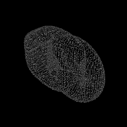

Genus-2 surface via smooth blending of two overlapping tori

An implicit surface of genus 2 (a surface with two holes), extracted via marching cubes from a polynomial implicit function. The shape resembles a pretzel or figure-eight.

Recommended representation: **surface_shell**

Seed behavior: **deterministic**

Performance: O(N³) in voxel_resolution

**Parameters:**

| Parameter | Type | Default | Range | Description |
|---|---|---|---|---|
| `separation` | float | 1.15 | — | Separation |
| `major_radius` | float | 1 | — | Major radius |
| `tube_radius` | float | 0.4 | — | Tube radius |
| `blend_sharpness` | float | 15 | — | Blend sharpness |

**Resolution parameters:**

| Parameter | Default | Description |
|---|---|---|
| `voxel_resolution` | 128 | Number of voxels per axis (N³ cost) |

**Example configurations:**

- Default genus-2 pretzel
  ```bash
  mathviz generate genus2_surface  --output genus2_surface.ply
  ```

### gyroid

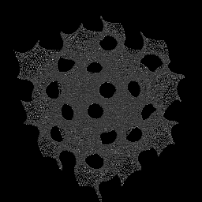

Triply periodic gyroid minimal surface via marching cubes

The gyroid is a triply periodic minimal surface described by sin(x)cos(y) + sin(y)cos(z) + sin(z)cos(x) = 0. It appears in butterfly wings, block copolymers, and 3D printing lattices.

Recommended representation: **surface_shell**

Seed behavior: **deterministic**

Performance: O(N³) in voxel_resolution

**Parameters:**

| Parameter | Type | Default | Range | Description |
|---|---|---|---|---|
| `periods` | int | 2 | — | Periods |

**Resolution parameters:**

| Parameter | Default | Description |
|---|---|---|
| `voxel_resolution` | 128 | Number of voxels per axis (N³ cost) |

**Example configurations:**

- Standard gyroid unit cell
  ```bash
  mathviz generate gyroid  --output gyroid.ply
  ```

### schwarz_d

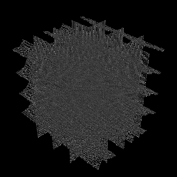

Triply periodic Schwarz D minimal surface via marching cubes

The Schwarz D (diamond) surface is a triply periodic minimal surface with the symmetry of a diamond crystal lattice. It is described by cos(x)cos(y)cos(z) − sin(x)sin(y)sin(z) = 0.

Recommended representation: **surface_shell**

Seed behavior: **deterministic**

Performance: O(N³) in voxel_resolution

**Parameters:**

| Parameter | Type | Default | Range | Description |
|---|---|---|---|---|
| `periods` | int | 2 | — | Periods |

**Resolution parameters:**

| Parameter | Default | Description |
|---|---|---|
| `voxel_resolution` | 128 | Number of voxels per axis (N³ cost) |

**Example configurations:**

- Standard Schwarz D
  ```bash
  mathviz generate schwarz_d  --output schwarz_d.ply
  ```

### schwarz_p

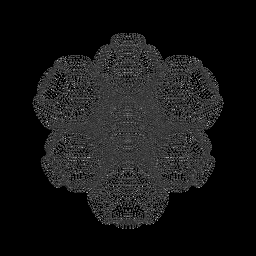

Triply periodic Schwarz P minimal surface via marching cubes

The Schwarz P (primitive) surface is the simplest triply periodic minimal surface, described by cos(x) + cos(y) + cos(z) = 0. It divides space into two congruent labyrinths.

Recommended representation: **surface_shell**

Seed behavior: **deterministic**

Performance: O(N³) in voxel_resolution

**Parameters:**

| Parameter | Type | Default | Range | Description |
|---|---|---|---|---|
| `periods` | int | 2 | — | Periods |

**Resolution parameters:**

| Parameter | Default | Description |
|---|---|---|
| `voxel_resolution` | 128 | Number of voxels per axis (N³ cost) |

**Example configurations:**

- Standard Schwarz P
  ```bash
  mathviz generate schwarz_p  --output schwarz_p.ply
  ```

## Knots

Mathematical knots and linked structures rendered as tube meshes.

### borromean_rings

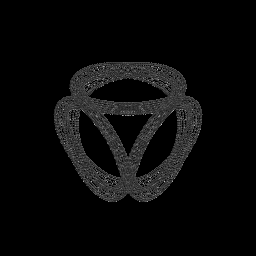

Three mutually linked rings — removing any one frees the other two

Three mutually interlocked rings where no two are directly linked — cutting any one ring frees the other two. A classic example from knot theory and topology.

Recommended representation: **tube**

Seed behavior: **deterministic**

**Parameters:**

| Parameter | Type | Default | Range | Description |
|---|---|---|---|---|
| `ring_radius` | float | 1 | — | Ring radius |
| `ring_thickness` | float | 0.08 | — | Ring thickness |

**Resolution parameters:**

| Parameter | Default | Description |
|---|---|---|
| `curve_points` | 512 | Number of sample points per ring |

**Example configurations:**

- Standard Borromean rings
  ```bash
  mathviz generate borromean_rings  --output borromean_rings.ply
  ```

### chain_links

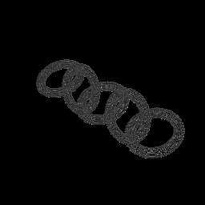

Chain of interlocking torus links with alternating orientation

A chain of interlocked torus-shaped links, like a physical chain. Each link passes through the next, creating a linked sequence.

Recommended representation: **tube**

Seed behavior: **deterministic**

**Parameters:**

| Parameter | Type | Default | Range | Description |
|---|---|---|---|---|
| `num_links` | int | 5 | — | Num links |
| `link_radius` | float | 0.5 | — | Link radius |
| `link_thickness` | float | 0.1 | — | Link thickness |

**Resolution parameters:**

| Parameter | Default | Description |
|---|---|---|
| `curve_points` | 256 | Number of sample points per link |

**Example configurations:**

- Short chain of 3 links
  ```bash
  mathviz generate chain_links  --output chain_links.ply
  ```

### cinquefoil_knot

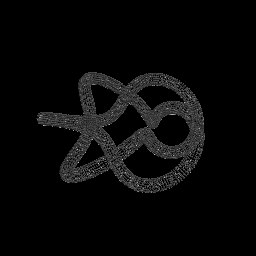

Cinquefoil (2,5) torus knot — a five-lobed star knot

The cinquefoil (5₁) knot is a (5,2) torus knot that winds five times around a torus while circling twice through the hole. It has five crossings and is the second-simplest prime knot after the trefoil.

Recommended representation: **tube**

Seed behavior: **deterministic**

No additional parameters.

**Resolution parameters:**

| Parameter | Default | Description |
|---|---|---|
| `curve_points` | 1024 | Number of sample points along the knot curve |

**Example configurations:**

- Standard cinquefoil
  ```bash
  mathviz generate cinquefoil_knot  --output cinquefoil_knot.ply
  ```

### figure_eight_knot

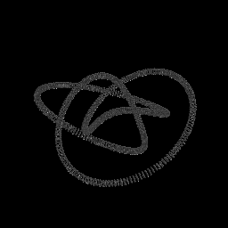

Figure-eight knot with crossing number 4

The figure-eight knot (4₁) is the simplest non-torus prime knot, with four crossings. Its shape traces a path reminiscent of the digit 8 viewed at an angle.

Recommended representation: **tube**

Seed behavior: **deterministic**

**Parameters:**

| Parameter | Type | Default | Range | Description |
|---|---|---|---|---|
| `scale` | float | 1 | — | Scale |

**Resolution parameters:**

| Parameter | Default | Description |
|---|---|---|
| `curve_points` | 1024 | Number of sample points along the knot curve |

**Example configurations:**

- Classic figure-eight knot
  ```bash
  mathviz generate figure_eight_knot  --output figure_eight_knot.ply
  ```

### lissajous_knot

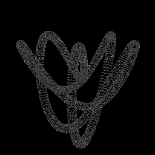

Lissajous knot with configurable frequencies and phases

Lissajous knots arise from 3D Lissajous curves with coprime frequencies chosen so the curve is knotted. Different frequency ratios and phases produce different knot types.

Recommended representation: **tube**

Seed behavior: **deterministic**

**Parameters:**

| Parameter | Type | Default | Range | Description |
|---|---|---|---|---|
| `nx` | int | 2 | — | Nx |
| `ny` | int | 3 | — | Ny |
| `nz` | int | 5 | — | Nz |
| `phase_x` | float | 0 | — | Phase x |
| `phase_y` | float | 0.7 | — | Phase y |
| `phase_z` | float | 0.2 | — | Phase z |
| `scale` | float | 1 | — | Scale |

**Resolution parameters:**

| Parameter | Default | Description |
|---|---|---|
| `curve_points` | 1024 | Number of sample points along the knot curve |

**Example configurations:**

- Simple Lissajous knot
  ```bash
  mathviz generate lissajous_knot --param nx=2 --param ny=3 --param nz=5 --output lissajous_knot.ply
  ```

### pretzel_knot

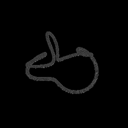

Pretzel knot with p left-hand and q right-hand twists

A torus knot with configurable (p, q) winding numbers. Setting p > q creates wider pretzel-like shapes with multiple lobes wrapping around the torus.

Recommended representation: **tube**

Seed behavior: **deterministic**

**Parameters:**

| Parameter | Type | Default | Range | Description |
|---|---|---|---|---|
| `p` | int | 2 | — | P |
| `q` | int | 3 | — | Q |

**Resolution parameters:**

| Parameter | Default | Description |
|---|---|---|
| `curve_points` | 1024 | Number of sample points along the knot curve |

**Example configurations:**

- Wide pretzel shape
  ```bash
  mathviz generate pretzel_knot --param p=11 --param q=1 --output pretzel_knot.ply
  ```
- Trefoil-like winding
  ```bash
  mathviz generate pretzel_knot --param p=2 --param q=3 --output pretzel_knot.ply
  ```

### seven_crossing_knots

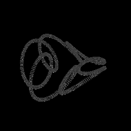

Knots with crossing number 7, selectable by knot_index

The seven-crossing knots are the prime knots with exactly seven crossings. There are seven such knots (7₁ through 7₇), selectable by index.

Recommended representation: **tube**

Seed behavior: **deterministic**

**Parameters:**

| Parameter | Type | Default | Range | Description |
|---|---|---|---|---|
| `knot_index` | int | 1 | — | Knot index |
| `scale` | float | 1 | — | Scale |

**Resolution parameters:**

| Parameter | Default | Description |
|---|---|---|
| `curve_points` | 1024 | Number of sample points along the knot curve |

**Example configurations:**

- First seven-crossing knot (7₁)
  ```bash
  mathviz generate seven_crossing_knots --param knot_index=1 --output seven_crossing_knots.ply
  ```
- Seventh variant (7₇)
  ```bash
  mathviz generate seven_crossing_knots --param knot_index=7 --output seven_crossing_knots.ply
  ```

### torus_knot


Torus knot curve with configurable (p, q) winding numbers

A torus knot winds p times around a torus while circling q times through the hole. The (2,3) torus knot is the trefoil; (2,5) is the cinquefoil. Coprime p,q always produce a single-component knot.

Aliases: `trefoil`, `cinquefoil`

Recommended representation: **tube**

Seed behavior: **deterministic**

**Parameters:**

| Parameter | Type | Default | Range | Description |
|---|---|---|---|---|
| `p` | int | 2 | — | P |
| `q` | int | 3 | — | Q |
| `R` | float | 1 | — | Major radius of the embedding torus |
| `r` | float | 0.4 | — | Minor radius of the tube |

**Resolution parameters:**

| Parameter | Default | Description |
|---|---|---|
| `curve_points` | 1024 | Number of sample points along the knot curve |

**Example configurations:**

- Trefoil knot (2,3)
  ```bash
  mathviz generate torus_knot --param p=2 --param q=3 --output torus_knot.ply
  ```
- Solomon's seal knot (2,5)
  ```bash
  mathviz generate torus_knot --param p=2 --param q=5 --output torus_knot.ply
  ```
- Wide (3,7) torus knot
  ```bash
  mathviz generate torus_knot --param p=3 --param q=7 --param R=1.0 --param r=0.3 --output torus_knot.ply
  ```

### trefoil_on_torus

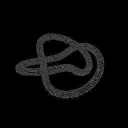

(2,3) torus knot with wireframe torus surface showing how the knot sits on the torus

The (2,3) trefoil knot displayed on its embedding torus, with the torus surface shown as a wireframe. This illustrates why it is called a "torus knot."

Recommended representation: **tube**

Seed behavior: **deterministic**

**Parameters:**

| Parameter | Type | Default | Range | Description |
|---|---|---|---|---|
| `torus_R` | float | 1 | — | Major radius of the torus |
| `torus_r` | float | 0.4 | — | Minor radius of the torus tube |

**Resolution parameters:**

| Parameter | Default | Description |
|---|---|---|
| `curve_points` | 1024 | Number of sample points along the knot curve |
| `torus_resolution` | 32 | Grid divisions per axis for the torus mesh |

**Example configurations:**

- Default trefoil on torus
  ```bash
  mathviz generate trefoil_on_torus --param torus_R=1.0 --param torus_r=0.4 --output trefoil_on_torus.ply
  ```

## Number Theory

Visualizations of number-theoretic patterns.

### digit_encoding

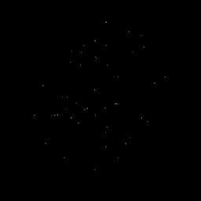

Digits of mathematical constants as 3D point heights

Digits of mathematical constants (π, e, φ, etc.) encoded as a 3D point sequence where each digit's value becomes the z-height. Reveals patterns (or their absence) in digit sequences.

Aliases: `digits`

Recommended representation: **weighted_cloud**

Seed behavior: **deterministic**

**Parameters:**

| Parameter | Type | Default | Range | Description |
|---|---|---|---|---|
| `constant` | str | `"pi"` | — | Constant |
| `height_scale` | float | 0.1 | — | Height scale |
| `spacing` | float | 0.1 | — | Spacing |

**Resolution parameters:**

| Parameter | Default | Description |
|---|---|---|
| `num_digits` | 100 | Number of digits to encode |

**Example configurations:**

- First 200 digits of π
  ```bash
  mathviz generate digit_encoding --param constant=pi --param num_digits=200 --output digit_encoding.ply
  ```
- Digits of e with tall bars
  ```bash
  mathviz generate digit_encoding --param constant=e --param height_scale=0.3 --output digit_encoding.ply
  ```

### prime_gaps

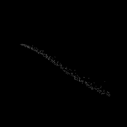

Prime gaps visualized as a 3D ribbon

Visualizes the gaps between consecutive prime numbers as a 3D ribbon. The x-axis is the prime index, y-height is the gap size, and the ribbon width adds visual weight.

Recommended representation: **weighted_cloud**

Seed behavior: **deterministic**

**Parameters:**

| Parameter | Type | Default | Range | Description |
|---|---|---|---|---|
| `x_spacing` | float | 0.1 | — | X spacing |
| `y_scale` | float | 0.1 | — | Y scale |
| `ribbon_width` | float | 0.5 | — | Ribbon width |

**Resolution parameters:**

| Parameter | Default | Description |
|---|---|---|
| `num_primes` | 500 | Number of primes to compute gaps between |

**Example configurations:**

- First 500 prime gaps
  ```bash
  mathviz generate prime_gaps --param x_spacing=0.1 --param y_scale=0.1 --param ribbon_width=0.5 --output prime_gaps.ply
  ```
- Dense view of 1000 gaps
  ```bash
  mathviz generate prime_gaps --param x_spacing=0.05 --param y_scale=0.05 --param ribbon_width=0.3 --output prime_gaps.ply
  ```

### sacks_spiral

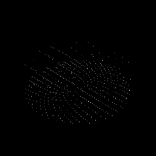

Sacks spiral — primes on an Archimedean spiral

The Sacks spiral places integers on an Archimedean spiral with perfect squares at the cardinal directions. Prime numbers are elevated in z, revealing diagonal patterns in prime distribution.

Aliases: `sacks`

Recommended representation: **weighted_cloud**

Seed behavior: **deterministic**

**Parameters:**

| Parameter | Type | Default | Range | Description |
|---|---|---|---|---|
| `prime_height` | float | 1 | — | Prime height |
| `scale` | float | 0.1 | — | Scale |

**Resolution parameters:**

| Parameter | Default | Description |
|---|---|---|
| `num_points` | 1000 | Number of integers to place on the spiral |

**Example configurations:**

- Standard Sacks spiral
  ```bash
  mathviz generate sacks_spiral --param prime_height=1.0 --param scale=0.1 --output sacks_spiral.ply
  ```

### ulam_spiral


Ulam spiral with primes elevated in z

The Ulam spiral arranges integers in a square spiral and elevates primes in z. Diagonal lines of primes emerge, corresponding to prime-rich quadratic polynomials.

Aliases: `ulam`

Recommended representation: **weighted_cloud**

Seed behavior: **deterministic**

**Parameters:**

| Parameter | Type | Default | Range | Description |
|---|---|---|---|---|
| `prime_height` | float | 1 | — | Prime height |
| `spacing` | float | 0.1 | — | Spacing |

**Resolution parameters:**

| Parameter | Default | Description |
|---|---|---|
| `num_points` | 1000 | Number of integers to place on the spiral |

**Example configurations:**

- Standard Ulam spiral
  ```bash
  mathviz generate ulam_spiral --param prime_height=1.0 --param spacing=0.1 --output ulam_spiral.ply
  ```

## Parametric Surfaces

Parametric surfaces defined by explicit coordinate formulas.

### bour_surface


Minimal surface interpolating between helicoid and catenoid

Bour's minimal surface is a one-parameter family that interpolates between a helicoid (n=1) and shapes with increasing numbers of petal-like folds. Higher n produces flower-like geometry.

Aliases: `bour`

Recommended representation: **surface_shell**

Seed behavior: **deterministic**

**Parameters:**

| Parameter | Type | Default | Range | Description |
|---|---|---|---|---|
| `n` | int | 2 | 1–10 (step 1) | N |
| `r_max` | float | 1 | 0.1–3.0 (step 0.1) | R max |

**Resolution parameters:**

| Parameter | Default | Description |
|---|---|---|
| `grid_resolution` | 128 | Number of grid divisions per axis |

**Example configurations:**

- Two-petal Bour surface
  ```bash
  mathviz generate bour_surface --param n=2 --param r_max=1.0 --output bour_surface.ply
  ```
- Five-petal flower
  ```bash
  mathviz generate bour_surface --param n=5 --param r_max=0.8 --output bour_surface.ply
  ```

### boy_surface


Boy surface (RP² immersion) with triple self-intersection

Boy's surface is a non-orientable surface — an immersion of the real projective plane RP² in 3D. It has a single triple self-intersection point and 3-fold symmetry.

Recommended representation: **surface_shell**

Seed behavior: **deterministic**

**Parameters:**

| Parameter | Type | Default | Range | Description |
|---|---|---|---|---|
| `scale` | float | 1 | — | Scale |
| `separation_epsilon` | float | 0.005 | — | Separation epsilon |

**Resolution parameters:**

| Parameter | Default | Description |
|---|---|---|
| `grid_resolution` | 128 | Number of grid divisions per axis |

**Example configurations:**

- Standard Boy surface
  ```bash
  mathviz generate boy_surface --param scale=1.0 --output boy_surface.ply
  ```

### calabi_yau


Calabi-Yau manifold cross-section — crystalline flower-like string theory shape from z1^n + z2^n = 1 in C²

A cross-section of a Calabi-Yau manifold, the compact spaces from string theory. Defined by z₁ⁿ + z₂ⁿ = 1 in C², producing crystalline flower-like shapes with n-fold symmetry.

Aliases: `calabi_yau_manifold`

Recommended representation: **surface_shell**

Seed behavior: **deterministic**

**Parameters:**

| Parameter | Type | Default | Range | Description |
|---|---|---|---|---|
| `n` | int | 5 | — | N |
| `alpha` | float | 0.785398 | — | Alpha |

**Resolution parameters:**

| Parameter | Default | Description |
|---|---|---|
| `grid_resolution` | 128 | Number of grid divisions per axis |

**Example configurations:**

- 5-fold Calabi-Yau (default)
  ```bash
  mathviz generate calabi_yau --param n=5 --output calabi_yau.ply
  ```
- 3-fold with wider cross-section
  ```bash
  mathviz generate calabi_yau --param n=3 --param alpha=1.0 --output calabi_yau.ply
  ```

### costa_surface


Costa minimal surface via Weierstrass-Enneper representation

The Costa minimal surface is a complete embedded minimal surface of genus 1 with three ends, discovered in 1984. It resembles a saddle pierced by a tube.

Recommended representation: **surface_shell**

Seed behavior: **deterministic**

**Parameters:**

| Parameter | Type | Default | Range | Description |
|---|---|---|---|---|
| `scale` | float | 0.1 | — | Scale |

**Resolution parameters:**

| Parameter | Default | Description |
|---|---|---|
| `grid_resolution` | 64 | Number of grid divisions per axis |

**Example configurations:**

- Standard Costa surface
  ```bash
  mathviz generate costa_surface --param scale=0.1 --output costa_surface.ply
  ```

### cross_cap


Non-orientable cross-cap immersion of the real projective plane

The cross-cap is another immersion of the real projective plane RP² in 3D. Unlike Boy's surface, it has a line of self-intersection rather than a triple point.

Aliases: `crosscap`

Recommended representation: **surface_shell**

Seed behavior: **deterministic**

**Parameters:**

| Parameter | Type | Default | Range | Description |
|---|---|---|---|---|
| `scale` | float | 1 | — | Scale |
| `separation_epsilon` | float | 0.005 | — | Separation epsilon |

**Resolution parameters:**

| Parameter | Default | Description |
|---|---|---|
| `grid_resolution` | 128 | Number of grid divisions per axis |

**Example configurations:**

- Standard cross-cap
  ```bash
  mathviz generate cross_cap --param scale=1.0 --output cross_cap.ply
  ```

### dini_surface


Twisted pseudospherical surface resembling a seashell

Dini's surface is a pseudospherical surface with constant negative Gaussian curvature, resembling a twisted seashell. It is generated by twisting a tractrix around an axis.

Aliases: `dini`

Recommended representation: **surface_shell**

Seed behavior: **deterministic**

**Parameters:**

| Parameter | Type | Default | Range | Description |
|---|---|---|---|---|
| `a` | float | 1 | 0.1–5.0 (step 0.1) | A |
| `b` | float | 0.2 | 0.01–1.0 (step 0.01) | B |
| `turns` | int | 2 | 1–10 (step 1) | Turns |

**Resolution parameters:**

| Parameter | Default | Description |
|---|---|---|
| `grid_resolution` | 128 | Number of grid divisions per axis |

**Example configurations:**

- Tight seashell with 2 turns
  ```bash
  mathviz generate dini_surface --param a=1.0 --param b=0.2 --param turns=2 --output dini_surface.ply
  ```
- Long twisted horn with 6 turns
  ```bash
  mathviz generate dini_surface --param a=1.0 --param b=0.1 --param turns=6 --output dini_surface.ply
  ```

### dna_helix


DNA double helix with twin helices and base pair rungs

A DNA double helix with two intertwined backbone curves and connecting base-pair rungs. Parameters control the pitch, radius, and number of base pairs per turn.

Aliases: `dna`, `double_helix`

Recommended representation: **tube**

Seed behavior: **deterministic**

**Parameters:**

| Parameter | Type | Default | Range | Description |
|---|---|---|---|---|
| `turns` | int | 3 | — | Turns |
| `radius` | float | 1 | — | Radius |
| `rise_per_turn` | float | 3.4 | — | Rise per turn |
| `base_pairs_per_turn` | int | 10 | — | Base pairs per turn |

**Resolution parameters:**

| Parameter | Default | Description |
|---|---|---|
| `curve_points` | 512 | Number of sample points per helix backbone |

**Example configurations:**

- Standard B-DNA proportions
  ```bash
  mathviz generate dna_helix --param turns=3 --param radius=1.0 --param rise_per_turn=3.4 --param base_pairs_per_turn=10 --output dna_helix.ply
  ```
- Compact helix with more turns
  ```bash
  mathviz generate dna_helix --param turns=6 --param radius=0.8 --param rise_per_turn=2.5 --output dna_helix.ply
  ```

### dupin_cyclide


Dupin cyclide — inversive geometry shape generalizing torus, cylinder, and cone

A Dupin cyclide is a surface that generalizes torus, cylinder, and cone shapes through inversive geometry. It is an envelope of a one-parameter family of spheres.

Aliases: `cyclide`

Recommended representation: **surface_shell**

Seed behavior: **deterministic**

**Parameters:**

| Parameter | Type | Default | Range | Description |
|---|---|---|---|---|
| `a` | float | 1 | 0.5–3.0 (step 0.1) | A |
| `b` | float | 0.8 | 0.1–2.0 (step 0.1) | B |
| `c` | float | 0.5 | 0.1–0.8 (step 0.1) | C |
| `d` | float | 0.6 | 0.1–2.0 (step 0.1) | D |

**Resolution parameters:**

| Parameter | Default | Description |
|---|---|---|
| `grid_resolution` | 128 | Number of grid divisions per axis |

**Example configurations:**

- Nearly toroidal cyclide
  ```bash
  mathviz generate dupin_cyclide --param a=1.0 --param b=0.8 --param c=0.5 --param d=0.6 --output dupin_cyclide.ply
  ```
- Horn-like deformation
  ```bash
  mathviz generate dupin_cyclide --param a=2.0 --param b=1.5 --param c=0.3 --param d=1.0 --output dupin_cyclide.ply
  ```

### enneper_surface


Enneper minimal surface with configurable range and order

Enneper's minimal surface is a self-intersecting surface with zero mean curvature. Higher orders produce more complex saddle-like shapes with additional lobes.

Recommended representation: **surface_shell**

Seed behavior: **deterministic**

**Parameters:**

| Parameter | Type | Default | Range | Description |
|---|---|---|---|---|
| `range` | float | 2 | — | Range |
| `order` | int | 1 | — | Order |

**Resolution parameters:**

| Parameter | Default | Description |
|---|---|---|
| `grid_resolution` | 128 | Number of grid divisions per axis |

**Example configurations:**

- Standard first-order Enneper
  ```bash
  mathviz generate enneper_surface --param range=2.0 --param order=1 --output enneper_surface.ply
  ```
- Second-order with 4-fold symmetry
  ```bash
  mathviz generate enneper_surface --param range=1.5 --param order=2 --output enneper_surface.ply
  ```

### hopf_fibration


Hopf fibration: S² base circles mapped to linked fiber tori in R³ via stereographic projection

The Hopf fibration maps circles on S² to linked fiber curves in S³, then projects to R³ via stereographic projection. Each fiber is a circle, and fibers from nearby base points are linked.

Aliases: `hopf`

Recommended representation: **tube**

Seed behavior: **deterministic**

**Parameters:**

| Parameter | Type | Default | Range | Description |
|---|---|---|---|---|
| `num_fibers` | int | 32 | — | Num fibers |
| `num_circles` | int | 5 | — | Num circles |
| `projection_point` | list | `[0.0, 0.0, 0.0, 2.0]` | — | Projection point |

**Resolution parameters:**

| Parameter | Default | Description |
|---|---|---|
| `fiber_points` | 256 | Number of sample points per fiber curve |

**Example configurations:**

- Standard fibration with 5 base circles
  ```bash
  mathviz generate hopf_fibration --param num_fibers=32 --param num_circles=5 --output hopf_fibration.ply
  ```
- Dense fibration with many fibers
  ```bash
  mathviz generate hopf_fibration --param num_fibers=64 --param num_circles=8 --output hopf_fibration.ply
  ```

### klein_bottle


Klein bottle immersion with self-intersection

The Klein bottle is a non-orientable surface with no boundary — like a Möbius strip closed into a tube. It cannot be embedded in 3D without self-intersection.

Recommended representation: **surface_shell**

Seed behavior: **deterministic**

**Parameters:**

| Parameter | Type | Default | Range | Description |
|---|---|---|---|---|
| `scale` | float | 1 | — | Scale |
| `separation_epsilon` | float | 0.005 | — | Separation epsilon |

**Resolution parameters:**

| Parameter | Default | Description |
|---|---|---|
| `grid_resolution` | 128 | Number of grid divisions per axis |

**Example configurations:**

- Standard Klein bottle
  ```bash
  mathviz generate klein_bottle --param scale=1.0 --output klein_bottle.ply
  ```

### linked_tori


Chain of interlocking tori, like links in a chain

Multiple tori arranged in an interlocking chain, like links of a chain. Each torus passes through the next, creating a linked topological structure.

Recommended representation: **surface_shell**

Seed behavior: **deterministic**

**Parameters:**

| Parameter | Type | Default | Range | Description |
|---|---|---|---|---|
| `num_tori` | int | 2 | 2–10 (step 1) | Num tori |
| `major_radius` | float | 1 | 0.3–3.0 (step 0.1) | Major radius |
| `minor_radius` | float | 0.3 | 0.05–1.0 (step 0.05) | Minor radius |
| `link_spacing` | float | 1.5 | 0.5–4.0 (step 0.1) | Link spacing |

**Resolution parameters:**

| Parameter | Default | Description |
|---|---|---|
| `grid_resolution` | 64 | Number of grid divisions per axis per torus |

**Example configurations:**

- Two linked tori
  ```bash
  mathviz generate linked_tori --param num_tori=2 --param major_radius=1.0 --param minor_radius=0.3 --output linked_tori.ply
  ```
- Chain of 5 links
  ```bash
  mathviz generate linked_tori --param num_tori=5 --param major_radius=0.8 --param minor_radius=0.2 --param link_spacing=1.2 --output linked_tori.ply
  ```

### lissajous_surface


Tubular surface around a Lissajous knot curve

A tubular surface wrapped around a 3D Lissajous curve. The frequencies and phases of the underlying curve control the knot-like topology of the resulting tube.

Recommended representation: **surface_shell**

Seed behavior: **deterministic**

**Parameters:**

| Parameter | Type | Default | Range | Description |
|---|---|---|---|---|
| `nx` | int | 2 | — | Nx |
| `ny` | int | 3 | — | Ny |
| `nz` | int | 5 | — | Nz |
| `phase_x` | float | 0 | — | Phase x |
| `phase_y` | float | 0 | — | Phase y |
| `phase_z` | float | 0 | — | Phase z |
| `tube_radius` | float | 0.1 | — | Tube radius |

**Resolution parameters:**

| Parameter | Default | Description |
|---|---|---|
| `grid_resolution` | 128 | Number of grid divisions per axis |

**Example configurations:**

- Default Lissajous tube
  ```bash
  mathviz generate lissajous_surface --param nx=2 --param ny=3 --param nz=5 --param tube_radius=0.1 --output lissajous_surface.ply
  ```
- Thicker tube with different frequencies
  ```bash
  mathviz generate lissajous_surface --param nx=3 --param ny=4 --param nz=7 --param tube_radius=0.15 --output lissajous_surface.ply
  ```

### mobius_strip


Möbius strip with configurable radius and width

The Möbius strip is a non-orientable surface with only one side and one boundary curve, formed by giving a rectangular strip a half-twist and joining the ends.

Recommended representation: **surface_shell**

Seed behavior: **deterministic**

**Parameters:**

| Parameter | Type | Default | Range | Description |
|---|---|---|---|---|
| `radius` | float | 1 | — | Radius |
| `half_width` | float | 0.4 | — | Half width |

**Resolution parameters:**

| Parameter | Default | Description |
|---|---|---|
| `grid_resolution` | 128 | Number of grid divisions per axis |

**Example configurations:**

- Standard Möbius strip
  ```bash
  mathviz generate mobius_strip --param radius=1.0 --param half_width=0.4 --output mobius_strip.ply
  ```
- Wide strip
  ```bash
  mathviz generate mobius_strip --param radius=1.0 --param half_width=0.8 --output mobius_strip.ply
  ```

### mobius_trefoil


Möbius strip twisted into a trefoil knot shape, combining non-orientability with knot topology

A Möbius strip whose centerline follows a trefoil knot instead of a circle. This combines the non-orientability of the Möbius strip with the knotted topology of the trefoil.

Recommended representation: **surface_shell**

Seed behavior: **deterministic**

**Parameters:**

| Parameter | Type | Default | Range | Description |
|---|---|---|---|---|
| `width` | float | 0.3 | — | Width |

**Resolution parameters:**

| Parameter | Default | Description |
|---|---|---|
| `curve_points` | 1024 | Number of points along the trefoil centerline |
| `grid_resolution` | 32 | Cross-section resolution of the strip |

**Example configurations:**

- Narrow Möbius trefoil
  ```bash
  mathviz generate mobius_trefoil --param width=0.2 --output mobius_trefoil.ply
  ```
- Wide Möbius trefoil
  ```bash
  mathviz generate mobius_trefoil --param width=0.5 --output mobius_trefoil.ply
  ```

### roman_surface


Self-intersecting non-orientable surface with tetrahedral symmetry

Steiner's Roman surface is a self-intersecting immersion of RP² in 3D with tetrahedral symmetry. It has three lines of self-intersection meeting at a triple point.

Aliases: `steiner_surface`

Recommended representation: **surface_shell**

Seed behavior: **deterministic**

**Parameters:**

| Parameter | Type | Default | Range | Description |
|---|---|---|---|---|
| `scale` | float | 1 | — | Scale |
| `separation_epsilon` | float | 0.005 | — | Separation epsilon |

**Resolution parameters:**

| Parameter | Default | Description |
|---|---|---|
| `grid_resolution` | 128 | Number of grid divisions per axis |

**Example configurations:**

- Standard Roman surface
  ```bash
  mathviz generate roman_surface --param scale=1.0 --output roman_surface.ply
  ```

### rose_surface


Rhodonea (rose) curve revolved into 3D, producing flower-like petal patterns via r = cos(k1·θ)·cos(k2·φ) on a sphere

A rhodonea (rose) curve pattern applied to a sphere, where the radius modulation r = cos(k₁θ)·cos(k₂φ) creates flower-like petal arrangements in 3D.

Recommended representation: **surface_shell**

Seed behavior: **deterministic**

**Parameters:**

| Parameter | Type | Default | Range | Description |
|---|---|---|---|---|
| `k1` | int | 3 | 1–12 (step 1) | K1 |
| `k2` | int | 2 | 1–12 (step 1) | K2 |

**Resolution parameters:**

| Parameter | Default | Description |
|---|---|---|
| `grid_resolution` | 128 | Number of grid divisions per axis |

**Example configurations:**

- Six-petal rose (3,2)
  ```bash
  mathviz generate rose_surface --param k1=3 --param k2=2 --output rose_surface.ply
  ```
- Complex 12-petal pattern
  ```bash
  mathviz generate rose_surface --param k1=6 --param k2=4 --output rose_surface.ply
  ```

### seifert_surface


Orientable surface bounded by a knot (Seifert surface)

A Seifert surface is an orientable surface bounded by a knot. It provides a way to "fill in" a knot with a surface, useful for computing knot invariants.

Aliases: `seifert`

Recommended representation: **surface_shell**

Seed behavior: **deterministic**

**Parameters:**

| Parameter | Type | Default | Range | Description |
|---|---|---|---|---|
| `knot_type` | str | `"trefoil"` | — | Knot type |
| `theta` | float | 0 | 0.0–6.283185307179586 (step 0.1) | Theta |

**Resolution parameters:**

| Parameter | Default | Description |
|---|---|---|
| `grid_resolution` | 128 | Number of grid divisions per axis |

**Example configurations:**

- Seifert surface for trefoil
  ```bash
  mathviz generate seifert_surface --param knot_type=trefoil --param theta=0.0 --output seifert_surface.ply
  ```

### shell_spiral


Logarithmic spiral with exponentially expanding cross-section, producing a nautilus-like seashell form

A logarithmic spiral with an exponentially expanding cross-section, producing a nautilus-like seashell form. Growth rate and opening rate control the shell proportions.

Recommended representation: **surface_shell**

Seed behavior: **deterministic**

**Parameters:**

| Parameter | Type | Default | Range | Description |
|---|---|---|---|---|
| `growth_rate` | float | 0.1 | 0.01–0.5 (step 0.01) | Growth rate |
| `turns` | int | 3 | 0.5–8.0 (step 0.5) | Turns |
| `opening_rate` | float | 0.08 | 0.0–0.3 (step 0.01) | Opening rate |
| `ellipticity` | float | 1 | 0.1–5.0 (step 0.1) | Ellipticity |

**Resolution parameters:**

| Parameter | Default | Description |
|---|---|---|
| `curve_points` | 1024 | Number of points along the spiral centerline |
| `radial_segments` | 32 | Number of segments around the cross-section |

**Example configurations:**

- Classic nautilus shell
  ```bash
  mathviz generate shell_spiral --param growth_rate=0.1 --param turns=3 --param opening_rate=0.08 --output shell_spiral.ply
  ```
- Tall conical shell
  ```bash
  mathviz generate shell_spiral --param growth_rate=0.2 --param turns=5 --param opening_rate=0.15 --param ellipticity=2.0 --output shell_spiral.ply
  ```

### spherical_harmonics


Sphere modulated by spherical harmonics

A sphere whose radius is modulated by real spherical harmonics Y_l^m. The l and m quantum numbers control the angular frequency and symmetry of the surface deformation.

Recommended representation: **surface_shell**

Seed behavior: **deterministic**

**Parameters:**

| Parameter | Type | Default | Range | Description |
|---|---|---|---|---|
| `l` | int | 0 | — | L |
| `m` | int | 0 | — | M |
| `base_radius` | float | 1 | — | Base radius |
| `amplitude` | float | 0.3 | — | Amplitude |

**Resolution parameters:**

| Parameter | Default | Description |
|---|---|---|
| `grid_resolution` | 128 | Number of grid divisions per axis |

**Example configurations:**

- Pure sphere (l=0, m=0)
  ```bash
  mathviz generate spherical_harmonics --param l=0 --param m=0 --param amplitude=0.3 --output spherical_harmonics.ply
  ```
- Peanut shape (l=2, m=0)
  ```bash
  mathviz generate spherical_harmonics --param l=2 --param m=0 --param amplitude=0.5 --output spherical_harmonics.ply
  ```
- Four-lobed clover (l=2, m=2)
  ```bash
  mathviz generate spherical_harmonics --param l=2 --param m=2 --param amplitude=0.5 --output spherical_harmonics.ply
  ```

### superellipsoid


Superellipsoid with configurable exponents and radii

A superellipsoid generalizes the ellipsoid by allowing independent exponents for the two parametric directions. Exponents < 1 produce pinched shapes; > 1 produces rounded cubes.

Recommended representation: **surface_shell**

Seed behavior: **deterministic**

**Parameters:**

| Parameter | Type | Default | Range | Description |
|---|---|---|---|---|
| `a1` | float | 1 | — | A1 |
| `a2` | float | 1 | — | A2 |
| `a3` | float | 1 | — | A3 |
| `e1` | float | 1 | — | E1 |
| `e2` | float | 1 | — | E2 |

**Resolution parameters:**

| Parameter | Default | Description |
|---|---|---|
| `grid_resolution` | 128 | Number of grid divisions per axis |

**Example configurations:**

- Rounded cube (e1=0.3, e2=0.3)
  ```bash
  mathviz generate superellipsoid --param e1=0.3 --param e2=0.3 --output superellipsoid.ply
  ```
- Pinched pillow (e1=2.0, e2=0.5)
  ```bash
  mathviz generate superellipsoid --param e1=2.0 --param e2=0.5 --output superellipsoid.ply
  ```

### torus


Parametric torus surface with configurable radii

The torus is the product of two circles — a donut shape defined by its major radius (center to tube center) and minor radius (tube thickness). The simplest non-trivial surface of revolution.

Recommended representation: **surface_shell**

Seed behavior: **deterministic**

**Parameters:**

| Parameter | Type | Default | Range | Description |
|---|---|---|---|---|
| `major_radius` | float | 1 | 0.3–3.0 (step 0.1) | Major radius |
| `minor_radius` | float | 0.4 | 0.05–1.0 (step 0.05) | Minor radius |

**Resolution parameters:**

| Parameter | Default | Description |
|---|---|---|
| `grid_resolution` | 128 | Number of grid divisions per axis |

**Example configurations:**

- Standard donut
  ```bash
  mathviz generate torus --param major_radius=1.0 --param minor_radius=0.4 --output torus.ply
  ```
- Thin ring
  ```bash
  mathviz generate torus --param major_radius=2.0 --param minor_radius=0.1 --output torus.ply
  ```
- Fat torus approaching sphere
  ```bash
  mathviz generate torus --param major_radius=1.0 --param minor_radius=0.9 --output torus.ply
  ```

### twisted_torus


Torus with cross-section rotating N half-twists around the loop; twist=1 produces a Möbius-torus

A torus whose cross-section rotates by N half-twists as it goes around the loop. twist=1 gives a Möbius-torus (single-sided); twist=2 gives a full-twist torus; higher values create braided forms.

Recommended representation: **surface_shell**

Seed behavior: **deterministic**

**Parameters:**

| Parameter | Type | Default | Range | Description |
|---|---|---|---|---|
| `twist` | int | 3 | 0–12 (step 1) | Twist |
| `major_radius` | float | 1 | 0.3–3.0 (step 0.1) | Major radius |
| `minor_radius` | float | 0.3 | 0.05–1.0 (step 0.05) | Minor radius |

**Resolution parameters:**

| Parameter | Default | Description |
|---|---|---|
| `grid_resolution` | 128 | Number of grid divisions per axis |

**Example configurations:**

- Möbius-torus (1 half-twist)
  ```bash
  mathviz generate twisted_torus --param twist=1 --param major_radius=1.0 --param minor_radius=0.3 --output twisted_torus.ply
  ```
- Triple-twist torus
  ```bash
  mathviz generate twisted_torus --param twist=3 --param major_radius=1.0 --param minor_radius=0.3 --output twisted_torus.ply
  ```

## Physics

Physics simulations and field visualizations.

### electron_orbital


Hydrogen atom electron orbital probability density isosurface

Isosurface of the hydrogen atom electron probability density |ψ|² for quantum numbers (n, l, m). Different orbitals produce spherical, dumbbell, and clover-shaped surfaces.

Aliases: `hydrogen_orbital`

Recommended representation: **surface_shell**

Seed behavior: **deterministic**

Performance: O(N³) in voxel_resolution

**Parameters:**

| Parameter | Type | Default | Range | Description |
|---|---|---|---|---|
| `n` | int | 3 | 1–4 (step 1) | N |
| `l` | int | 2 | 0–3 (step 1) | L |
| `m` | int | 0 | -3–3 (step 1) | M |
| `iso_level` | float | 0.01 | 0.001–0.1 (step 0.001) | Iso level |

**Resolution parameters:**

| Parameter | Default | Description |
|---|---|---|
| `voxel_resolution` | 128 | Voxels per axis (N³ cost) |

**Example configurations:**

- d-orbital (n=3, l=2, m=0)
  ```bash
  mathviz generate electron_orbital --param n=3 --param l=2 --param m=0 --param iso_level=0.01 --output electron_orbital.ply
  ```
- p-orbital dumbbell (n=2, l=1, m=0)
  ```bash
  mathviz generate electron_orbital --param n=2 --param l=1 --param m=0 --param iso_level=0.01 --output electron_orbital.ply
  ```

### gravitational_lensing


Warped coordinate grid showing spacetime curvature around a point mass via Schwarzschild deflection

A coordinate grid warped by Schwarzschild spacetime curvature around a point mass. Grid lines bend near the mass, illustrating gravitational lensing from general relativity.

Aliases: `grav_lens`, `spacetime_grid`

Recommended representation: **tube**

Seed behavior: **deterministic**

**Parameters:**

| Parameter | Type | Default | Range | Description |
|---|---|---|---|---|
| `mass` | float | 1 | — | Mass |
| `grid_lines` | int | 20 | — | Grid lines |
| `grid_extent` | float | 5 | — | Grid extent |

**Resolution parameters:**

| Parameter | Default | Description |
|---|---|---|
| `grid_points` | 200 | Sample points per grid line |

**Example configurations:**

- Moderate lensing
  ```bash
  mathviz generate gravitational_lensing --param mass=1.0 --param grid_lines=20 --output gravitational_lensing.ply
  ```
- Strong lensing
  ```bash
  mathviz generate gravitational_lensing --param mass=3.0 --param grid_lines=30 --output gravitational_lensing.ply
  ```

### kepler_orbit


Elliptical orbit from classical orbital elements

An elliptical orbit computed from classical Keplerian orbital elements. The semi-major axis and eccentricity define the orbit shape; inclination tilts it out of the xy-plane.

Recommended representation: **tube**

Seed behavior: **deterministic**

**Parameters:**

| Parameter | Type | Default | Range | Description |
|---|---|---|---|---|
| `semi_major_axis` | float | 1 | — | Semi major axis |
| `eccentricity` | float | 0.5 | — | Eccentricity |
| `inclination` | float | 0 | — | Inclination |

**Resolution parameters:**

| Parameter | Default | Description |
|---|---|---|
| `curve_points` | 1024 | Number of sample points along the orbit |

**Example configurations:**

- Circular orbit
  ```bash
  mathviz generate kepler_orbit --param semi_major_axis=1.0 --param eccentricity=0.0 --output kepler_orbit.ply
  ```
- Highly eccentric comet-like orbit
  ```bash
  mathviz generate kepler_orbit --param semi_major_axis=2.0 --param eccentricity=0.9 --param inclination=0.5 --output kepler_orbit.ply
  ```

### magnetic_field


3D magnetic field lines for dipole and quadrupole configurations

3D magnetic field lines for dipole or quadrupole configurations. Lines are traced by integrating the field direction from seed points distributed around the origin.

Aliases: `mag_field`

Recommended representation: **tube**

Seed behavior: **deterministic**

**Parameters:**

| Parameter | Type | Default | Range | Description |
|---|---|---|---|---|
| `field_type` | str | `"dipole"` | — | Field type |
| `num_lines` | int | 24 | — | Num lines |
| `spread` | float | 0.3 | — | Spread |

**Resolution parameters:**

| Parameter | Default | Description |
|---|---|---|
| `line_points` | 500 | Integration steps per field line |

**Example configurations:**

- Dipole field (bar magnet)
  ```bash
  mathviz generate magnetic_field --param field_type=dipole --param num_lines=24 --output magnetic_field.ply
  ```
- Quadrupole field
  ```bash
  mathviz generate magnetic_field --param field_type=quadrupole --param num_lines=32 --output magnetic_field.ply
  ```

### nbody


Gravitational N-body simulation with seed-based initial conditions

Gravitational N-body simulation where bodies interact via Newtonian gravity. Initial positions and velocities are generated from the seed, producing unique chaotic trajectories.

Aliases: `n_body`

Recommended representation: **raw_point_cloud**

Seed behavior: **seed-dependent**

Performance: O(N² × integration_steps) where N is num_bodies

**Parameters:**

| Parameter | Type | Default | Range | Description |
|---|---|---|---|---|
| `num_bodies` | int | 3 | — | Num bodies |
| `time_span` | float | 10 | — | Time span |

**Resolution parameters:**

| Parameter | Default | Description |
|---|---|---|
| `integration_steps` | 5000 | Number of integration time steps |

**Example configurations:**

- Three-body dance
  ```bash
  mathviz generate nbody --param num_bodies=3 --param time_span=10.0 --output nbody.ply
  ```
- Five-body swarm
  ```bash
  mathviz generate nbody --param num_bodies=5 --param time_span=15.0 --output nbody.ply
  ```

### planetary_positions


Solar system orbits and planet positions at a given epoch

Solar system planet orbits and positions computed from Keplerian elements at a given Julian date epoch. Shows the eight planets and their orbital paths.

Aliases: `solar_system`

Recommended representation: **tube**

Seed behavior: **deterministic**

**Parameters:**

| Parameter | Type | Default | Range | Description |
|---|---|---|---|---|
| `epoch_jd` | float | 2.45154e+06 | — | Epoch jd |

**Resolution parameters:**

| Parameter | Default | Description |
|---|---|---|
| `curve_points` | 512 | Number of sample points per orbital curve |

**Example configurations:**

- J2000 epoch (2000-01-01)
  ```bash
  mathviz generate planetary_positions --param epoch_jd=2451545.0 --output planetary_positions.ply
  ```

### wave_interference


3D standing wave interference pattern from multiple point sources with isosurface extraction

Standing wave interference pattern from multiple point sources. The superposition of spherical waves creates an isosurface with complex nodal patterns.

Aliases: `wave_pattern`, `interference`

Recommended representation: **surface_shell**

Seed behavior: **deterministic**

Performance: O(N³) in voxel_resolution

**Parameters:**

| Parameter | Type | Default | Range | Description |
|---|---|---|---|---|
| `num_sources` | int | 3 | — | Num sources |
| `wavelength` | float | 0.5 | — | Wavelength |
| `source_spacing` | float | 1 | — | Source spacing |
| `iso_level` | float | 0.5 | — | Iso level |
| `time` | float | 0 | — | Time |

**Resolution parameters:**

| Parameter | Default | Description |
|---|---|---|
| `voxel_resolution` | 128 | Voxels per axis (N³ cost) |

**Example configurations:**

- 3-source interference
  ```bash
  mathviz generate wave_interference --param num_sources=3 --param wavelength=0.5 --output wave_interference.ply
  ```
- Dense pattern with short wavelength
  ```bash
  mathviz generate wave_interference --param num_sources=4 --param wavelength=0.3 --param iso_level=0.4 --output wave_interference.ply
  ```

## Procedural

Procedurally generated geometry from noise, L-systems, and reaction-diffusion.

### lsystem


L-system fractal trees, bushes, ferns, and space-filling curves

L-system (Lindenmayer system) fractals generated by iteratively rewriting a string with production rules, then interpreting the result as turtle graphics commands in 3D.

Recommended representation: **tube**

Seed behavior: **seed-dependent**

**Parameters:**

| Parameter | Type | Default | Range | Description |
|---|---|---|---|---|
| `preset` | str | `"tree"` | — | Preset |
| `iterations` | int | 5 | — | Iterations |
| `angle` | float | 25 | — | Angle |
| `length_scale` | float | 1 | — | Length scale |
| `length_decay` | float | 0.7 | — | Length decay |
| `thickness_decay` | float | 0.6 | — | Thickness decay |
| `jitter` | float | 5 | — | Jitter |

**Example configurations:**

- Fractal tree
  ```bash
  mathviz generate lsystem --param preset=tree --param iterations=5 --param angle=25.0 --output lsystem.ply
  ```
- Bush with wider branching
  ```bash
  mathviz generate lsystem --param preset=bush --param iterations=4 --param angle=30.0 --output lsystem.ply
  ```

### noise_surface


Seed-controlled simplex noise heightmap surface

A heightmap surface generated from simplex noise. The frequency controls the scale of features and height_scale controls the vertical exaggeration.

Aliases: `simplex_surface`

Recommended representation: **heightmap_relief**

Seed behavior: **seed-dependent**

**Parameters:**

| Parameter | Type | Default | Range | Description |
|---|---|---|---|---|
| `frequency` | float | 4 | — | Frequency |
| `height_scale` | float | 1 | — | Height scale |

**Resolution parameters:**

| Parameter | Default | Description |
|---|---|---|
| `pixel_resolution` | 256 | Grid points per axis (N² cost) |

**Example configurations:**

- Gentle rolling hills
  ```bash
  mathviz generate noise_surface --param frequency=2.0 --param height_scale=0.5 --output noise_surface.ply
  ```
- Rough terrain
  ```bash
  mathviz generate noise_surface --param frequency=8.0 --param height_scale=1.5 --output noise_surface.ply
  ```

### penrose_3d


Aperiodic Penrose P3 rhombus tiling extruded as 3D relief

A Penrose P3 aperiodic tiling extruded into 3D. The tiling uses fat and thin rhombuses arranged with 5-fold symmetry, defying periodic repetition.

Aliases: `penrose_tiling`, `penrose`

Recommended representation: **surface_shell**

Seed behavior: **deterministic**

**Parameters:**

| Parameter | Type | Default | Range | Description |
|---|---|---|---|---|
| `generations` | int | 5 | — | Generations |
| `tile_height_ratio` | float | 0.3 | — | Tile height ratio |
| `extent` | float | 5 | — | Extent |

**Example configurations:**

- Standard Penrose tiling relief
  ```bash
  mathviz generate penrose_3d --param generations=5 --param tile_height_ratio=0.3 --output penrose_3d.ply
  ```
- Taller extrusion
  ```bash
  mathviz generate penrose_3d --param generations=4 --param tile_height_ratio=0.8 --output penrose_3d.ply
  ```

### rd_surface


Gray-Scott reaction-diffusion on curved surface meshes

Gray-Scott reaction-diffusion simulation on a curved surface mesh. Chemical patterns (spots, stripes, labyrinthine) form on the surface, then displace it to create textured geometry.

Aliases: `reaction_diffusion_surface`

Recommended representation: **surface_shell**

Seed behavior: **seed-dependent**

Performance: O(iterations × grid_resolution²)

**Parameters:**

| Parameter | Type | Default | Range | Description |
|---|---|---|---|---|
| `base_surface` | str | `"torus"` | — | Base surface |
| `feed_rate` | float | 0.055 | — | Feed rate |
| `kill_rate` | float | 0.062 | — | Kill rate |
| `diffusion_u` | float | 0.16 | — | Diffusion u |
| `diffusion_v` | float | 0.08 | — | Diffusion v |
| `iterations` | int | 5000 | — | Iterations |
| `displacement_scale` | float | 0.1 | — | Displacement scale |

**Resolution parameters:**

| Parameter | Default | Description |
|---|---|---|
| `grid_resolution` | 128 | Base surface mesh resolution per axis |

**Example configurations:**

- Spots on a torus
  ```bash
  mathviz generate rd_surface --param base_surface=torus --param feed_rate=0.055 --param kill_rate=0.062 --output rd_surface.ply
  ```
- Stripes on a sphere
  ```bash
  mathviz generate rd_surface --param base_surface=sphere --param feed_rate=0.04 --param kill_rate=0.06 --output rd_surface.ply
  ```

### reaction_diffusion


Gray-Scott reaction-diffusion pattern as heightmap

Gray-Scott reaction-diffusion simulation on a flat grid, rendered as a heightmap. Feed and kill rates control the pattern type: spots, stripes, or labyrinthine structures.

Aliases: `gray_scott`

Recommended representation: **heightmap_relief**

Seed behavior: **seed-dependent**

Performance: O(timesteps × grid_size²)

**Parameters:**

| Parameter | Type | Default | Range | Description |
|---|---|---|---|---|
| `feed_rate` | float | 0.035 | — | Feed rate |
| `kill_rate` | float | 0.065 | — | Kill rate |
| `diffusion_u` | float | 0.16 | — | Diffusion u |
| `diffusion_v` | float | 0.08 | — | Diffusion v |
| `timesteps` | int | 5000 | — | Timesteps |
| `dt` | float | 1 | — | Dt |
| `height_scale` | float | 1 | — | Height scale |

**Resolution parameters:**

| Parameter | Default | Description |
|---|---|---|
| `grid_size` | 128 | Grid points per axis for simulation |

**Example configurations:**

- Spot pattern
  ```bash
  mathviz generate reaction_diffusion --param feed_rate=0.035 --param kill_rate=0.065 --output reaction_diffusion.ply
  ```
- Stripe/labyrinthine pattern
  ```bash
  mathviz generate reaction_diffusion --param feed_rate=0.04 --param kill_rate=0.06 --output reaction_diffusion.ply
  ```

### terrain


Multi-octave simplex noise terrain heightmap

Multi-octave simplex noise terrain using fractal Brownian motion. Multiple noise layers at different frequencies and amplitudes are summed to produce realistic mountainous terrain.

Aliases: `terrain_heightmap`

Recommended representation: **heightmap_relief**

Seed behavior: **seed-dependent**

**Parameters:**

| Parameter | Type | Default | Range | Description |
|---|---|---|---|---|
| `octaves` | int | 6 | — | Octaves |
| `persistence` | float | 0.5 | — | Persistence |
| `lacunarity` | float | 2 | — | Lacunarity |
| `base_frequency` | float | 3 | — | Base frequency |
| `height_scale` | float | 1 | — | Height scale |

**Resolution parameters:**

| Parameter | Default | Description |
|---|---|---|
| `pixel_resolution` | 256 | Grid points per axis (N² cost) |

**Example configurations:**

- Smooth rolling hills
  ```bash
  mathviz generate terrain --param octaves=3 --param persistence=0.4 --param base_frequency=2.0 --output terrain.ply
  ```
- Rugged mountain range
  ```bash
  mathviz generate terrain --param octaves=8 --param persistence=0.6 --param base_frequency=4.0 --param height_scale=1.5 --output terrain.ply
  ```

## Surfaces

Miscellaneous surface generators.

### parabolic_envelope


Ruled surface from a family of lines forming a parabolic envelope

A ruled surface formed by the envelope of a family of straight lines. The lines are tangent to a parabolic curve, creating a smooth curved surface from straight elements.

Recommended representation: **surface_shell**

Seed behavior: **deterministic**

**Parameters:**

| Parameter | Type | Default | Range | Description |
|---|---|---|---|---|
| `line_count` | int | 32 | — | Line count |
| `scale` | float | 1 | — | Scale |
| `height` | float | 0.5 | — | Height |

**Resolution parameters:**

| Parameter | Default | Description |
|---|---|---|
| `curve_points` | 64 | Number of sample points per line segment |

**Example configurations:**

- Standard envelope
  ```bash
  mathviz generate parabolic_envelope --param line_count=32 --param scale=1.0 --param height=0.5 --output parabolic_envelope.ply
  ```
- Dense envelope with many lines
  ```bash
  mathviz generate parabolic_envelope --param line_count=64 --param scale=1.5 --param height=0.3 --output parabolic_envelope.ply
  ```
